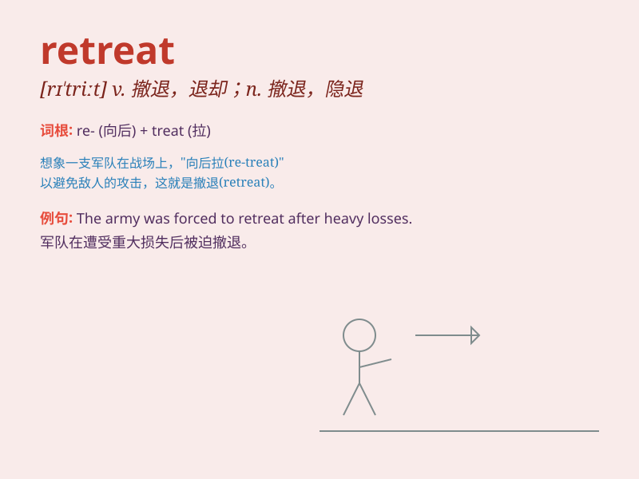

## retreat

**英音:** _[rɪ\'triːt]_ **美音:** _[rɪ\'trit]_

**译义:** *vi.撤退,退却n.撤退,退却*

### 短语

+ **retreat into oneself:** _变得沉默寡言；离群索居_

+ **retreat from reality:** _逃避现实_

+ **military retreat:** _军事撤退_

+ **retreat to safety:** _退到安全地带_

+ **retreat gracefully:** _优雅地撤退_

### 例句

#### 例句1

> **The army was forced to retreat.**

**中文翻译:** 军队被迫撤退。

**单词释义:** 撤退；退却

#### 例句2

> **She retreated to her room to think.**

**中文翻译:** 她退回到自己的房间去思考。

**单词释义:** 退避；躲开

#### 例句3

> **The prices are beginning to retreat.**

**中文翻译:** 价格开始回落。

**单词释义:** （价格等）下降；后退

### 背诵小故事

> A soldier was on the battlefield. The enemy was too strong. He had no
choice but to retreat. He ran back to safety, away from the fierce
fight. Remember, retreat means to move back or withdraw.

**一名士兵在战场上。敌人太强大了。他别无选择，只能撤退。他跑回安全地带，远离了激烈的战斗。记住，retreat
意思是后退、撤退。**

### 图义

