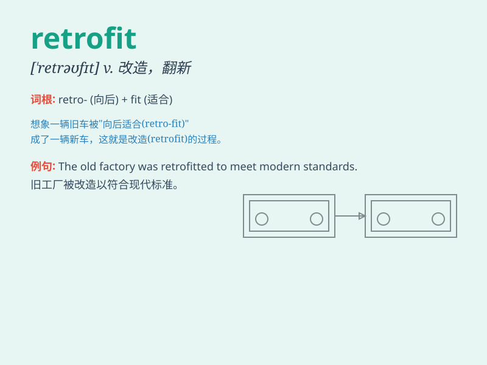

## retrofit

**英音:** _[\'retrəʊfɪt]_ **美音:** _[\'rɛtrofɪt]_

**译义:** *n.式样翻新,花样翻新*

### 短语

+ **retrofit project:** _改造项目_

+ **retrofit cost:** _改造成本_

+ **retrofit equipment:** _改装设备_

+ **retrofit building:** _翻新建筑_

+ **retrofit system:** _改造系统_

### 例句

#### 例句1

> **The company decided to retrofit its old factory with new
machinery.**

**中文翻译:** 这家公司决定用新机器对其旧工厂进行改造。

**单词释义:** 改造；给...翻新

#### 例句2

> **They retrofitted the car to make it more fuel-efficient.**

**中文翻译:** 他们对这辆汽车进行了改装以提高其燃油效率。

**单词释义:** 改装；改进

#### 例句3

> **The building was retrofitted to meet the latest safety
standards.**

**中文翻译:** 这座大楼经过改造以符合最新的安全标准。

**单词释义:** 使（建筑物）符合新规定；翻新

### 背诵小故事

>
想象一下，有一艘老旧的轮船。为了让它重新焕发活力，工程师们给它进行了一系列的改进和装备更新，这个过程就叫
retrofit。就好像给旧东西穿上新衣服，让它变得更好用！

**想象一艘老旧轮船被改进和装备更新的过程来辅助记忆 retrofit
这个单词，意为改进；翻新**

### 图义

