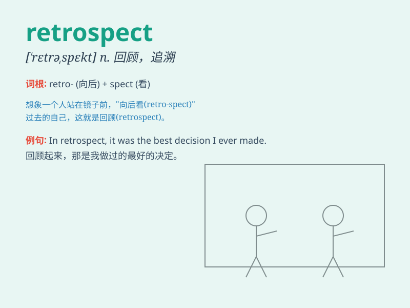

## retrospect

**英音:** _[\'retrəspekt]_ **美音:** _[\'rɛtrəspɛkt]_

**译义:** *n.回顾*

### 短语

+ **in retrospect:** _回顾；回想起来_

+ **retrospect and prospect:** _回顾与展望_

+ **retrospect to:** _回顾；追溯到_

+ **historical retrospect:** _历史回顾_

+ **retrospect analysis:** _回顾性分析_

### 例句

#### 例句1

> **In retrospect, I should have studied harder for the exam.**

**中文翻译:** 回想起来，我本应该为考试更努力学习的。

**单词释义:** 回想，回顾

#### 例句2

> **It was a mistake, but in retrospect, we learned a valuable
lesson.**

**中文翻译:** 这是个错误，但回过头来看，我们学到了宝贵的一课。

**单词释义:** 回顾，追溯

#### 例句3

> **Looking back in retrospect, our decision seems unwise now.**

**中文翻译:** 现在回过头来看，我们当时的决定似乎不明智。

**单词释义:** 回顾，追忆

### 背诵小故事

> A man was lost in the forest. When he finally found his way out, in
retrospect, he realized that he should have brought a map. It means to
look back and think about the past.

**一个男人在森林里迷路了。当他最终走出来时，回想起来，他意识到自己应该带一张地图。这个词意思是回顾，回想过去。**

### 图义

