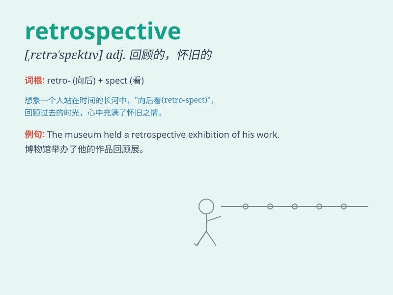

## retrospective

**英音:** _[retrə(ʊ)\'spektɪv]_ **美音:**
_[,rɛtrə\'spɛktɪv]_

**译义:** *adj.回顾的*

### 短语

+ **retrospective exhibition:** _回顾展_

+ **retrospective study:** _回顾性研究_

+ **retrospective analysis:** _回顾性分析_

+ **retrospective law:** _有追溯效力的法律_

+ **retrospective glance:** _回顾的目光_

### 例句

#### 例句1

> **The exhibition was a retrospective of the artist\'s work over the
past 20 years.**

**中文翻译:** 这次展览是对这位艺术家过去 20 年作品的回顾。

**单词释义:** 回顾；回想

#### 例句2

> **The company is conducting a retrospective analysis of its
marketing strategy.**

**中文翻译:** 公司正在对其营销策略进行回顾性分析。

**单词释义:** 回顾性的

#### 例句3

> **The retrospective film festival showcased classic movies from the
1950s.**

**中文翻译:** 这个回顾电影节展映了 20 世纪 50 年代的经典电影。

**单词释义:** 回顾的；怀旧的

### 背诵小故事

> A painter was having a retrospective of his works. He looked back at
all his past paintings, remembering the techniques and inspirations.
This made him realize how far he\'d come. \'Retrospective\' means
looking back on the past.

**一位画家正在举办他作品的回顾展。他回顾了自己所有过去的画作，回忆起技巧和灵感。这让他意识到自己走了多远。'retrospective'意思是回顾过去。**

### 图义

