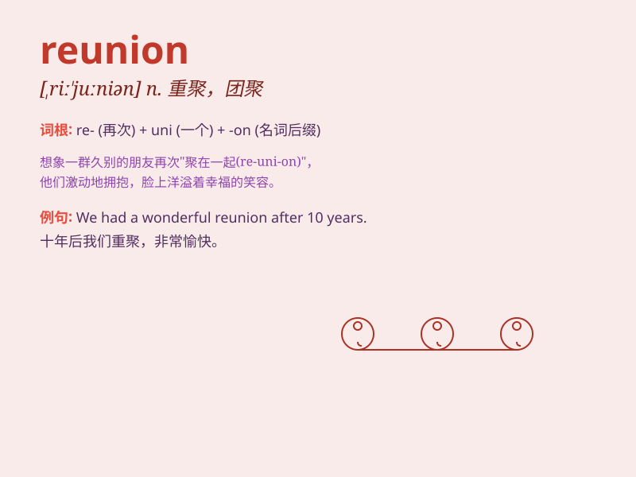

## reunion

**英音:** _[ˌriːˈjuːniən]_ **美音:** _[ˌriːˈjuːniən]_

**译义:** *n.团圆,重聚*

### 短语

+ **family reunion:** _家庭团聚_

+ **class reunion:** _同学聚会_

+ **reunion dinner:** _团圆饭_

+ **reunion party:** _重聚派对_

+ **annual reunion:** _年度团聚_

### 例句

#### 例句1

> **The family reunion was a joyous occasion.**

**中文翻译:** 这次家庭团聚是一个欢乐的时刻。

**单词释义:** 团聚；重聚

#### 例句2

> **They organized a reunion of old classmates.**

**中文翻译:** 他们组织了一次老同学聚会。

**单词释义:** 聚会；重逢

#### 例句3

> **The reunion of the band was highly anticipated by fans.**

**中文翻译:** 乐队的重聚受到粉丝们的高度期待。

**单词释义:** 重聚；再次相聚

### 背诵小故事

> A group of friends were separated for years. But one day, they got a
special invitation. When they all came together at a beautiful place, it
was a reunion. They shared memories, laughed and felt the warmth of
friendship again.

**一群朋友分开多年。但有一天，他们收到了一份特别的邀请。当他们都在一个美丽的地方相聚时，这就是重聚。他们分享回忆，欢笑，再次感受到了友谊的温暖。**

### 图义

