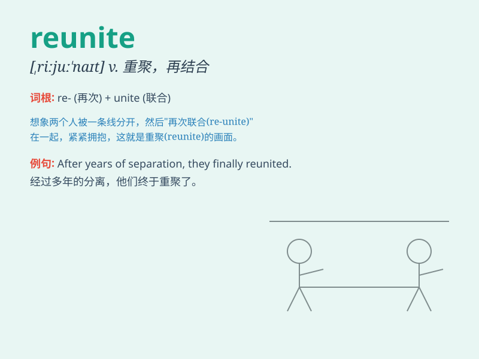

## reunite

**英音:** _[riːjʊ\'naɪt]_ **美音:** _[,riju\'naɪt]_

**译义:** *v.(使)再结合*

### 短语

+ **reunite with:** _与\...\...重聚_

+ **reunite family:** _家庭团聚_

+ **reunite lovers:** _让恋人重聚_

+ **reunite friends:** _朋友重聚_

+ **reunite after separation:** _分离后重聚_

### 例句

#### 例句1

> **The family was finally able to reunite after years of
separation.**

**中文翻译:** 这个家庭在多年分离后终于得以团聚。

**单词释义:** 团聚；重聚

#### 例句2

> **The lost dog was reunited with its owner.**

**中文翻译:** 走失的狗和它的主人重聚了。

**单词释义:** 使重聚；使再次相聚

#### 例句3

> **They worked hard to reunite the divided team.**

**中文翻译:** 他们努力让分裂的团队重新团结起来。

**单词释义:** 使团结；使联合

### 背诵小故事

> A group of friends were separated for years. But one day, by a lucky
chance, they all received the same invitation to a party. There, they
reunite, sharing hugs and laughter. It\'s a wonderful reunion.

**一群朋友分开了多年。但有一天，幸运的是，他们都收到了同一个聚会的邀请。在那里，他们重新团聚，互相拥抱，欢笑。这是一次美妙的重聚。**

### 图义

