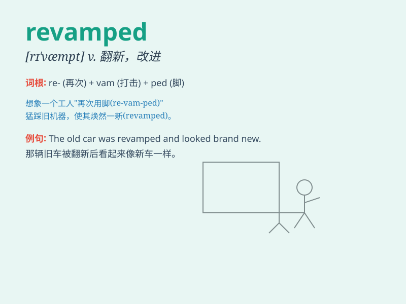

## revamped

**英音:** _null_ **美音:** _null_

**译义:** *null*

### 短语

+ **revamped version:** _改进版本_

+ **revamped plan:** _修订的计划_

+ **revamped website:** _翻新的网站_

+ **revamped system:** _改良的系统_

+ **revamped product:** _改进的产品_

### 例句

#### 例句1

> **The company revamped its website to attract more customers.**

**中文翻译:** 这家公司改进了它的网站以吸引更多的客户。

**单词释义:** 改进；翻新

#### 例句2

> **She revamped her wardrobe with the latest fashion trends.**

**中文翻译:** 她根据最新的时尚潮流翻新了她的衣橱。

**单词释义:** 翻新；修改

#### 例句3

> **The old hotel has been completely revamped and now looks modern
and luxurious.**

**中文翻译:** 这家旧酒店已经被彻底翻新，现在看起来既现代又豪华。

**单词释义:** 翻新；改造

### 背诵小故事

> A dilapidated old house was revamped by a skillful architect. He
added new windows, repainted the walls, and transformed it into a
beautiful home. Now it\'s shiny and new!

**一座破旧的老房子被一位技艺高超的建筑师翻新了。他添加了新窗户，重新粉刷了墙壁，把它变成了一个美丽的家。现在它焕然一新！**

### 图义

