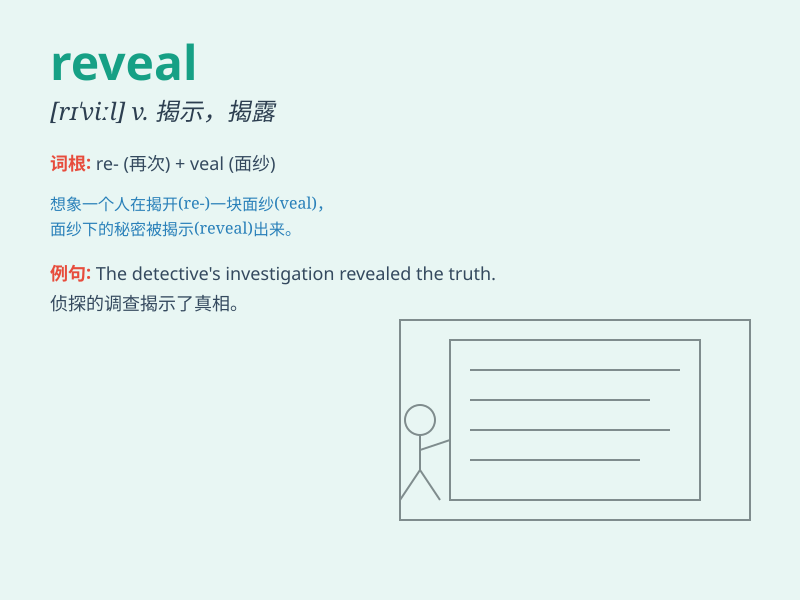

## reveal

**英音:** _[rɪ\'viːl]_ **美音:** _[rɪ\'vil]_

**译义:** *vt.展现,显示,揭示,暴露*

### 短语

+ **reveal oneself:** _显露自己；现出自己的本来面目_

+ **reveal secrets:** _泄露秘密_

+ **reveal the truth:** _揭露真相_

+ **reveal details:** _透露细节_

+ **reveal one\'s identity:** _暴露某人的身份_

### 例句

#### 例句1

> **The report revealed that the company was in financial
trouble.**

**中文翻译:** 这份报告揭示了该公司陷入了财务困境。

**单词释义:** 揭示；显示

#### 例句2

> **She revealed her true feelings at the party.**

**中文翻译:** 她在聚会上表露了自己的真实情感。

**单词释义:** 表露；透露

#### 例句3

> **The magician revealed the secret of the trick.**

**中文翻译:** 魔术师揭露了这个戏法的秘密。

**单词释义:** 揭露；揭穿

### 背诵小故事

> A detective was working on a mysterious case. Finally, he found a
hidden diary that revealed all the secrets. With this crucial discovery,
the truth came to light.

**一位侦探正在处理一起神秘案件。最后，他发现了一本隐藏的日记，这本日记揭示了所有的秘密。凭借这一关键发现，真相大白了。**

### 图义

