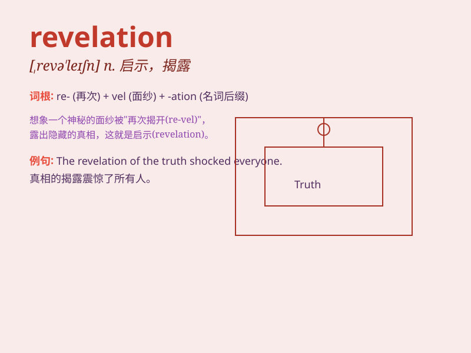

## revelation

**英音:** _[revə\'leɪʃ(ə)n]_ **美音:** _[\'rɛvə\'leʃən]_

**译义:** *n.显示,揭露,被揭露的事,新发现,启示,揭示*

### 短语

+ **divine revelation:** _神的启示_

+ **startling revelation:** _惊人的揭露_

+ **personal revelation:** _个人的启示_

+ **revelation of truth:** _真理的揭示_

+ **sudden revelation:** _突然的启示_

### 例句

#### 例句1

> **The revelation of the scandal shocked the public.**

**中文翻译:** 这一丑闻的揭露震惊了公众。

**单词释义:** 揭露；被揭露的真相

#### 例句2

> **The book contains many revelations about her private life.**

**中文翻译:** 这本书包含了许多有关她私生活的爆料。

**单词释义:** 爆料；透露的情况

#### 例句3

> **His sudden revelation caught everyone off guard.**

**中文翻译:** 他突然的透露让每个人都措手不及。

**单词释义:** 透露；透露的信息

### 背诵小故事

> One day, a detective was working on a mysterious case. Just when he
felt hopeless, a sudden revelation came. A hidden clue appeared, like a
light in the dark, leading him to solve the case. Revelation means a
surprising and enlightening disclosure.

**有一天，一位侦探正在处理一起神秘的案件。就在他感到无望时，突然有了一个启示。一个隐藏的线索出现了，就像黑暗中的一道光，引领他解决了案件。revelation
意思是令人惊奇的揭示、透露。**

### 图义

