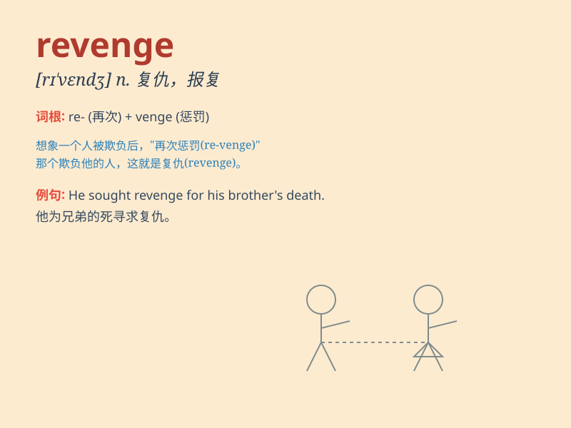

## revenge

**英音:** _[rɪ\'ven(d)ʒ]_ **美音:** _[rɪ\'vɛndʒ]_

**译义:** *n.报仇,复仇vt.替\...报仇,复仇*

### 短语

+ **take revenge:** _报仇；复仇_

+ **revenge oneself on:** _向\...报仇_

+ **in revenge:** _作为报复_

+ **be revenged on:** _向\...进行报复_

+ **an act of revenge:** _一次复仇行为_

### 例句

#### 例句1

> **He sought revenge for the injustice done to him.**

**中文翻译:** 他寻求对加诸于他的不公进行报复。

**单词释义:** 报复；复仇

#### 例句2

> **The best revenge is to live well.**

**中文翻译:** 最好的复仇就是过得好。

**单词释义:** 复仇；报复

#### 例句3

> **She took revenge on her ex-boyfriend by spreading rumors about
him.**

**中文翻译:** 她通过散布关于前男友的谣言来报复他。

**单词释义:** 报复；报仇

### 背诵小故事

> A man was wrongly accused and sent to prison. After his release, he
was determined to take revenge. He spent days planning and finally made
his move, showing that revenge was his only thought.

**一个男人被冤枉入狱。出狱后，他决心复仇。他花了好多天计划，最后采取了行动，表明复仇是他唯一的念头。**

### 图义

