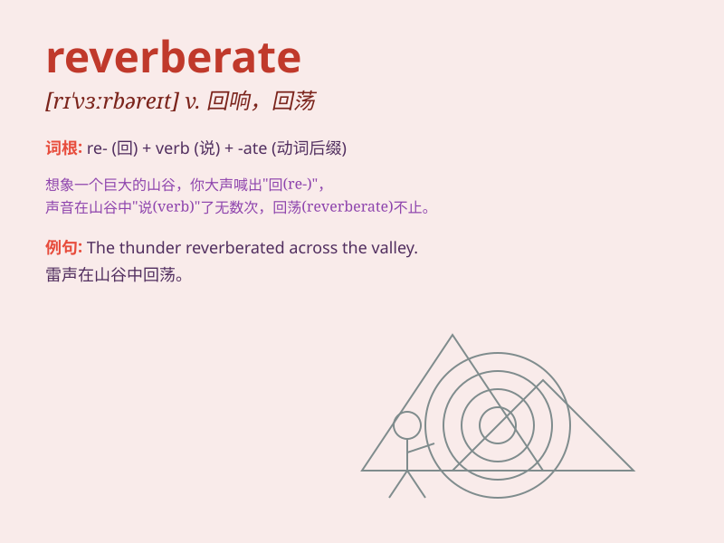

## reverberate

**英音:** _[rɪ\'vɜːbəreɪt]_ **美音:** _[rɪ\'vɝbə\'ret]_

**译义:** *v.反响*

### 短语

+ **reverberate through:** _在\...中回荡_

+ **reverberate with:** _回荡着\...；充满着\..._

+ **reverberate around:** _在周围回响_

+ **reverberate in one\'s mind:** _在某人脑海中回响_

+ **reverberate off:** _从\...反弹回响_

### 例句

#### 例句1

> **The sound of the explosion reverberated through the valley.**

**中文翻译:** 爆炸的声音在山谷中回荡。

**单词释义:** （声音）回响，回荡

#### 例句2

> **His words reverberated in my mind long after he had spoken.**

**中文翻译:** 他的话在他说完很久之后仍在我脑海中回响。

**单词释义:** （话语、思想等）回响，回荡

#### 例句3

> **The impact of the economic crisis reverberated across the
globe.**

**中文翻译:** 经济危机的影响在全球范围内产生反响。

**单词释义:** （影响）产生反响，扩散

### 背诵小故事

> In a deep cave, a huge bell was struck. The sound reverberated,
bouncing off the walls and echoing throughout. It kept resonating, as if
the cave itself was holding onto the sound. Remember, reverberate means
to echo or resound repeatedly.

**在一个幽深的洞穴里，一口大钟被敲响。声音回荡着，从洞壁反弹，在整个洞穴中回响。它持续共鸣，仿佛洞穴自身在留住这声音。记住，reverberate
意思是回响、回荡。**

### 图义

