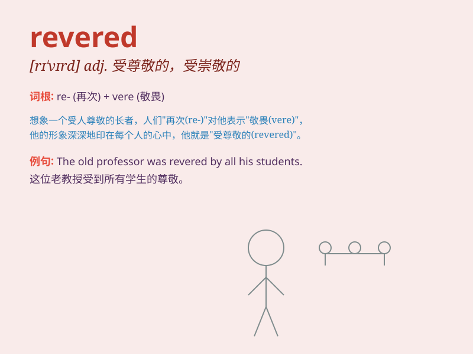

## revered

**英音:** _[rɪˈvɪəd]_ **美音:** _[rɪˈvɪrd]_

**译义:** *adj. 尊敬的；尊崇的；敬畏的*

### 短语

+ **be revered as:** _被尊为_

+ **highly revered:** _备受尊崇_

+ **revered figure:** _受尊敬的人物_

+ **widely revered:** _广泛尊崇_

+ **revered tradition:** _受尊崇的传统_

### 例句

#### 例句1

> **Martin Luther King Jr. is revered as a civil rights icon.**

**中文翻译:** 马丁·路德·金被尊为民权偶像。

**单词释义:** 尊敬；尊崇

#### 例句2

> **The ancient temple is revered by the local people.**

**中文翻译:** 这座古老的寺庙受到当地人的敬仰。

**单词释义:** 敬仰

#### 例句3

> **She is revered for her kindness and wisdom.**

**中文翻译:** 她因善良和智慧而备受尊敬。

**单词释义:** 尊敬；敬重

### 背诵小故事

> A young artist always dreamed of creating works that would be
revered. One day, his masterpiece was displayed in a grand exhibition
and received high praise. People looked at it with awe, showing that it
was deeply respected and admired.

**一位年轻的艺术家一直梦想创作出受人尊敬的作品。有一天，他的杰作在一个大型展览中展出并获得了高度赞扬。人们带着敬畏的目光看着它，表明它深受尊重和钦佩。**

### 图义

