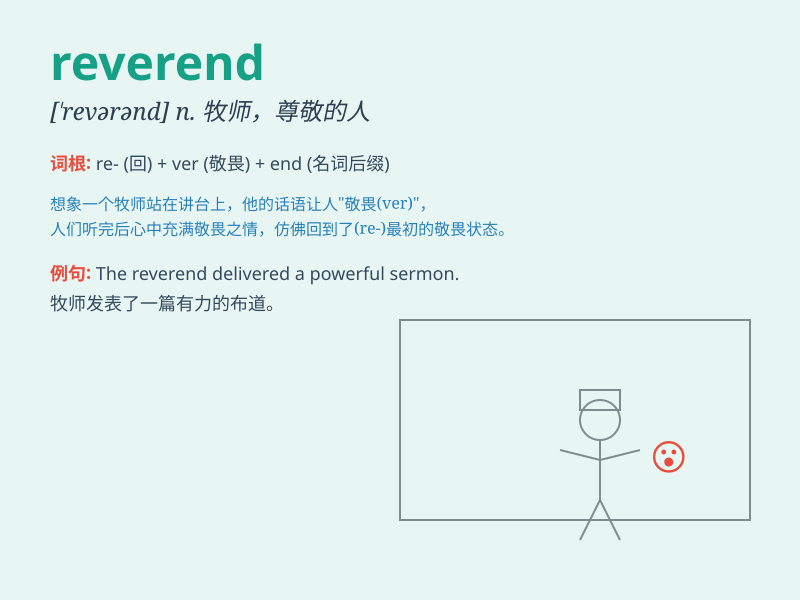

## Reverend

**英音:** _[ˈrevərənd]_ **美音:** _[ˈrɛvərənd]_

**译义:** *n.牧师，神父（作为姓名前的敬称）；adj.尊敬的，可敬的*

### 短语

+ **Reverend Father:** _神父_

+ **The Reverend:** _（用于神职人员姓名前的尊称）尊敬的_

+ **Reverend Mother:** _女修道院院长_

+ **Reverend Sir:** _尊敬的先生（对神职人员的称呼）_

+ **Reverend Doctor:** _尊敬的博士牧师_

### 例句

#### 例句1

> **The Reverend gave a powerful sermon at the church.**

**中文翻译:** 这位牧师在教堂做了一场有力的布道。

**单词释义:** 牧师

#### 例句2

> **Reverend Smith is well-respected in the community.**

**中文翻译:** 史密斯牧师在社区中备受尊敬。

**单词释义:** 牧师

#### 例句3

> **The letter was addressed to the Reverend Brown.**

**中文翻译:** 这封信是写给布朗牧师的。

**单词释义:** 牧师

### 背诵小故事

> A young boy was lost in a forest. When he felt hopeless, a kind
Reverend appeared and led him out safely. The Reverend\'s wisdom and
kindness left a deep impression on the boy.

**一个小男孩在森林里迷路了。当他感到绝望时，一位善良的牧师出现并安全地把他带了出来。这位牧师的智慧和善良给男孩留下了深刻的印象。**

### 图义

