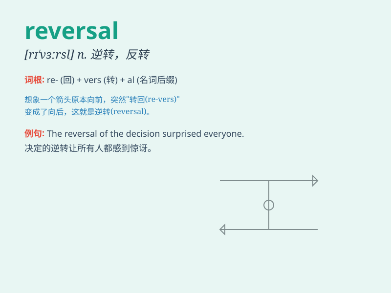

## reversal

**英音:** _[rɪ\'vɜːs(ə)l]_ **美音:** _[rɪ\'vɝsl]_

**译义:** *n.颠倒,反转,反向,逆转,撤销*

### 短语

+ **reversal of fortune:** _命运的逆转_

+ **reversal pattern:** _反转形态_

+ **policy reversal:** _政策逆转_

+ **trend reversal:** _趋势反转_

+ **market reversal:** _市场逆转_

### 例句

#### 例句1

> **The company\'s recent decision represents a complete reversal of
its previous policy.**

**中文翻译:** 公司最近的决定完全违背了其之前的政策。

**单词释义:** 反转；逆转

#### 例句2

> **There has been a sudden reversal in the stock market.**

**中文翻译:** 股市突然发生了逆转。

**单词释义:** 逆转；转变

#### 例句3

> **The judge\'s ruling was a reversal of the lower court\'s
decision.**

**中文翻译:** 法官的裁决推翻了下级法院的决定。

**单词释义:** 推翻；颠倒

### 背诵小故事

> A brave knight was on a quest. He faced many challenges but always
had a reversal of fortune. One day, a magic spell turned his losing
streak into victory. This unexpected change was a perfect example of a
\'reversal\'.

**一位勇敢的骑士正在执行任务。他面临诸多挑战，但总是时运逆转。有一天，一个魔法咒语将他的连败转为胜利。这种意想不到的变化就是"逆转"的完美例子。**

### 图义

