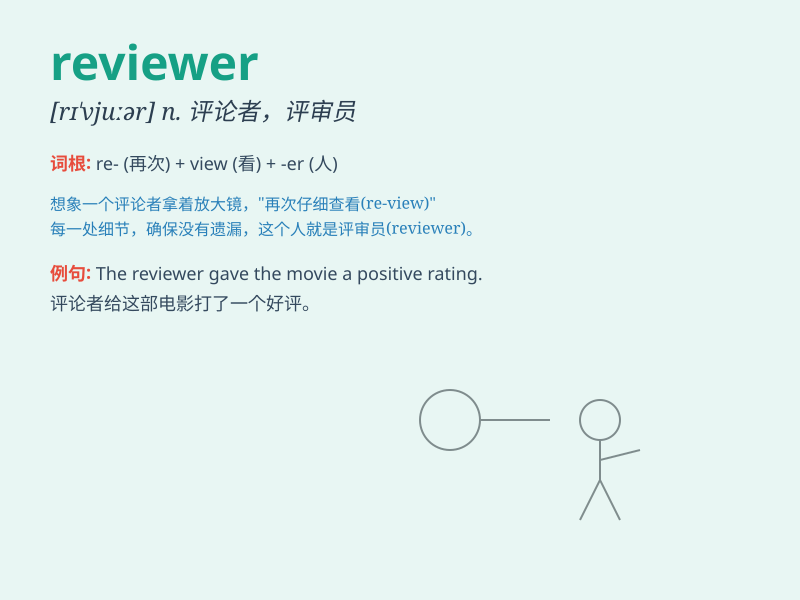

## reviewer

**英音:** _[rɪ\'vjuːə]_ **美音:** _[rɪ\'vjuɚ]_

**译义:** *n.批评家,评论家*

### 短语

+ **book reviewer:** _书评家_

+ **film reviewer:** _影评家_

+ **restaurant reviewer:** _餐厅评论家_

+ **product reviewer:** _产品评论家_

+ **music reviewer:** _音乐评论家_

### 例句

#### 例句1

> **The reviewer gave the book a high rating.**

**中文翻译:** 这位评论家给这本书打了高分。

**单词释义:** 评论家

#### 例句2

> **The film was harshly criticized by the reviewer.**

**中文翻译:** 这部电影遭到了评论员的严厉批评。

**单词释义:** 评论员

#### 例句3

> **The reviewer suggested some improvements for the manuscript.**

**中文翻译:** 审稿人对这份手稿提出了一些改进建议。

**单词释义:** 审稿人

### 背诵小故事

> A reviewer is like a detective. One day, a reviewer named Tom got a
new book. He read it carefully, looking for clues and details. Just like
a detective solving a case, he had to judge if the book was good or not.

**一位评论员就像一个侦探。有一天，名叫汤姆的评论员拿到一本新书。他仔细阅读，寻找线索和细节。就像侦探破案一样，他得判断这本书好不好。**

### 图义

