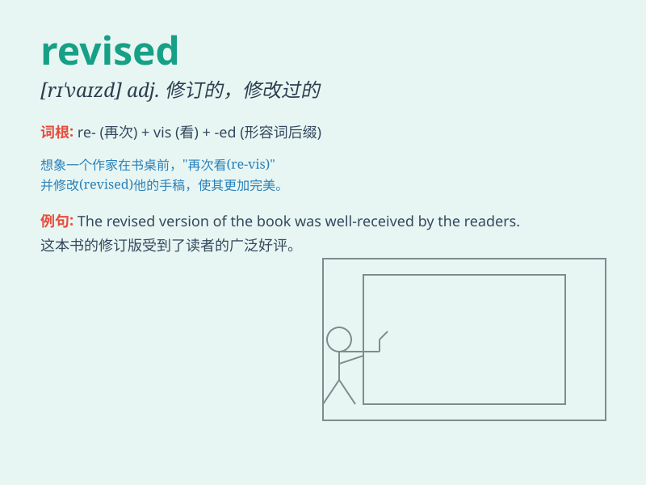

## revised

**英音:** _[rɪˈvaɪzd]_ **美音:** _[rɪˈvaɪzd]_

**译义:** *adj. 经过修订的；改进的；v. 修订；修正；复习（revise
的过去分词）*

### 短语

+ **revised edition:** _修订版_

+ **revised plan:** _修订后的计划_

+ **revised price:** _修订后的价格_

+ **revised schedule:** _修订后的时间表_

+ **revised version:** _修订版；修改后的版本_

### 例句

#### 例句1

> **The revised plan was presented to the committee.**

**中文翻译:** 修改后的计划被提交给了委员会。

**单词释义:** 修改后的

#### 例句2

> **She revised her opinion after considering all the facts.**

**中文翻译:** 在考虑了所有事实后，她修改了自己的意见。

**单词释义:** 修改

#### 例句3

> **The revised edition of the book has more updated information.**

**中文翻译:** 这本书的修订版有更多最新的信息。

**单词释义:** 修订的

### 背诵小故事

> A student revised his paper many times. He read it carefully, found
mistakes, and corrected them. Finally, his revised paper got a high
score.

**一个学生多次修改他的论文。他仔细阅读，发现错误并改正。最后，他修改后的论文得了高分。**

### 图义

