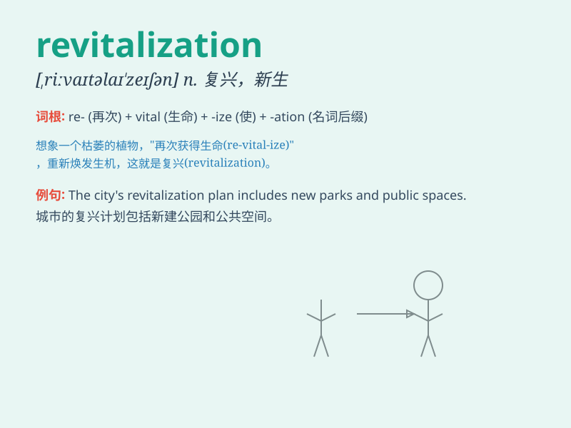

## revitalization

**英音:** _[riːˌvaɪtəlaɪ\'zeɪʃən]_ **美音:**
_[ˌrivaɪtlɪ\'zeʃən]_

**译义:** *n.新生 复兴*

### 短语

+ **economic revitalization:** _经济振兴_

+ **urban revitalization:** _城市复兴_

+ **industrial revitalization:** _工业振兴_

+ **regional revitalization:** _区域振兴_

+ **community revitalization:** _社区复兴_

### 例句

#### 例句1

> **The revitalization of the downtown area has brought new life to
the city.**

**中文翻译:** 市中心的复兴给这座城市带来了新的生机。

**单词释义:** 复兴；振兴

#### 例句2

> **The government is committed to the revitalization of the local
economy.**

**中文翻译:** 政府致力于当地经济的振兴。

**单词释义:** 振兴

#### 例句3

> **The revitalization of traditional culture is of great
significance in modern society.**

**中文翻译:** 传统文化的复兴在现代社会具有重要意义。

**单词释义:** 复兴

### 背诵小故事

> A once dying town needed revitalization. A smart leader came with new
ideas. They built parks, attracted businesses, and made the town lively
again. The process of bringing new life and energy was revitalization.

**一个曾经衰落的城镇需要复兴。一位聪明的领导者带着新想法来了。他们建造公园，吸引企业，让城镇再次充满活力。带来新生命和能量的这个过程就是复兴。**

### 图义

