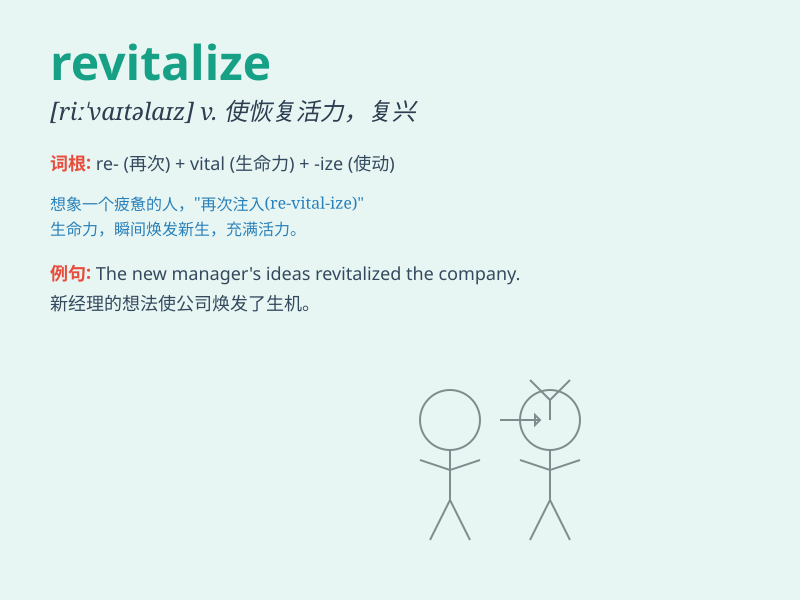

## revitalize

**英音:** _[ˌriːˈvaɪtəlaɪz]_ **美音:**
_[ˌriːˈvaɪtəlaɪz]_

**译义:** *v.新生*

### 短语

+ **revitalize the economy:** _振兴经济_

+ **revitalize a city:** _使一个城市恢复活力_

+ **revitalize the industry:** _重振工业_

+ **revitalize a neighborhood:** _使一个社区焕发生机_

+ **revitalize the market:** _激活市场_

### 例句

#### 例句1

> **The government\'s new policies aim to revitalize the economy.**

**中文翻译:** 政府的新政策旨在重振经济。

**单词释义:** 使复兴，使恢复生机

#### 例句2

> **We need to revitalize this old town to attract more tourists.**

**中文翻译:** 我们需要让这个古老的城镇恢复活力以吸引更多游客。

**单词释义:** 使恢复活力

#### 例句3

> **The company is trying to revitalize its brand image.**

**中文翻译:** 这家公司正在努力重塑其品牌形象。

**单词释义:** 使恢复生机，使振兴

### 背诵小故事

> A once dying town was in desperate need. Then a wise leader came and
implemented new policies, opened new businesses, and attracted tourists.
The town was revitalized, becoming lively and prosperous again.

**一个曾经奄奄一息的小镇急需拯救。然后一位明智的领导者来了，实施了新政策，开办了新企业，还吸引了游客。这个小镇被重振活力，再次变得热闹繁荣。**

### 图义

