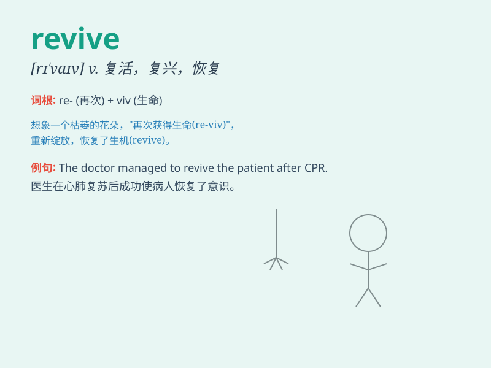

## revive

**英音:** _[rɪ\'vaɪv]_ **美音:** _[rɪ\'vaɪv]_

**译义:** *v.(使)苏醒,(使)复兴,(使)复活,(使)再生效,回想*

### 短语

+ **revive economy:** _振兴经济_

+ **revive hope:** _重燃希望_

+ **revive memory:** _恢复记忆_

+ **revive interest:** _重新激起兴趣_

+ **revive tradition:** _复兴传统_

### 例句

#### 例句1

> **The doctor managed to revive the patient who had been in a coma
for several days.**

**中文翻译:** 医生设法使昏迷了好几天的病人苏醒过来。

**单词释义:** 使苏醒；使恢复知觉

#### 例句2

> **The economy is beginning to revive after the recession.**

**中文翻译:** 经济在衰退后开始复苏。

**单词释义:** （使）复苏；（使）恢复

#### 例句3

> **The old tradition was revived in the town.**

**中文翻译:** 这个古老的传统在这个城镇被重新恢复了。

**单词释义:** 重新兴起；重新使用

### 背诵小故事

> A little bird was hurt and seemed lifeless. But with the gentle care
of a kind girl, it gradually regained strength and was able to fly
again. This process is like \'revive\', meaning to come back to life or
regain consciousness.

**一只小鸟受伤了，看上去毫无生机。但在一个善良女孩的温柔照料下，它逐渐恢复了力气，能够再次飞翔。这个过程就像'revive'，意思是复活、苏醒、恢复生机。**

### 图义

