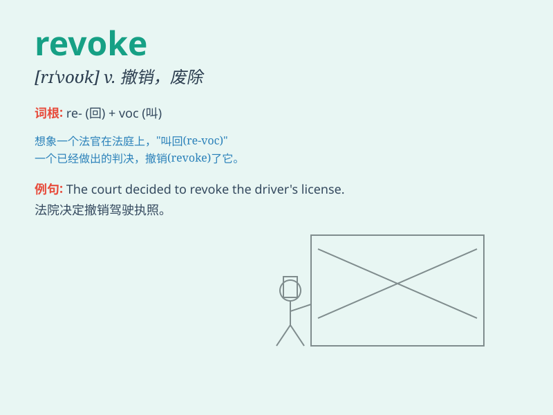

## revoke

**英音:** _[rɪ\'vəʊk]_ **美音:** _[rɪ\'vok]_

**译义:** *vt.撤回,废除,宣告无效vi.n.有牌不跟*

### 短语

+ **revoke a license:** _吊销执照_

+ **revoke a law:** _废除一项法律_

+ **revoke a permission:** _撤销许可_

+ **revoke a decision:** _取消决定_

+ **revoke a contract:** _解除合同_

### 例句

#### 例句1

> **The driver\'s license was revoked due to multiple speeding
violations.**

**中文翻译:** 由于多次超速违规，该司机的驾照被吊销了。

**单词释义:** 吊销

#### 例句2

> **The king revoked the nobleman\'s title and privileges.**

**中文翻译:** 国王撤销了贵族的头衔和特权。

**单词释义:** 撤销

#### 例句3

> **The company revoked the offer after discovering the candidate\'s
false information.**

**中文翻译:** 公司在发现候选人的虚假信息后取消了录用通知。

**单词释义:** 取消

### 背诵小故事

> A king was known for his kindness and had granted many privileges.
But when some people abused these, he had to revoke them. It was a tough
decision, but necessary for the kingdom\'s well-being.

**一位国王以仁慈著称，曾授予许多特权。但当一些人滥用这些特权时，他不得不撤销它们。这是一个艰难的决定，但对王国的福祉是必要的。**

### 图义

