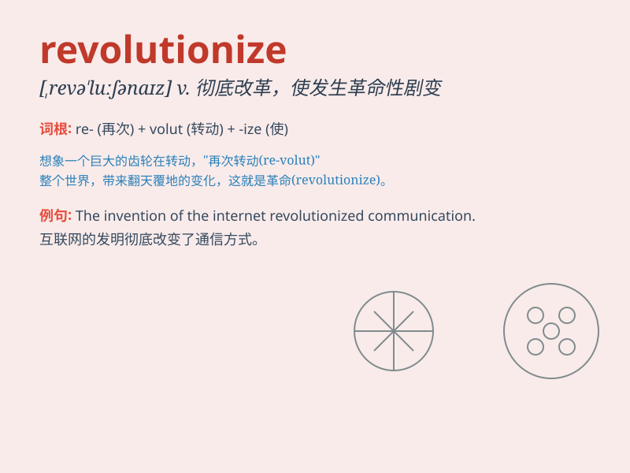

## revolutionize

**英音:** _[ˌrevəˈluːʃənaɪz]_ **美音:**
_[ˌrevəˈluːʃənaɪz]_

**译义:** *vt.宣传革命,大事改革*

### 短语

+ **revolutionize the industry:** _彻底改变这个行业_

+ **revolutionize one\'s thinking:** _彻底改变某人的思维_

+ **revolutionize the way of life:** _彻底变革生活方式_

+ **revolutionize the education system:** _彻底改革教育体制_

+ **revolutionize the medical field:** _彻底革新医疗领域_

### 例句

#### 例句1

> **The internet has revolutionized the way we communicate.**

**中文翻译:** 互联网已经彻底改变了我们交流的方式。

**单词释义:** 彻底改变

#### 例句2

> **This new technology is set to revolutionize the medical
industry.**

**中文翻译:** 这项新技术注定要给医疗行业带来变革。

**单词释义:** 给\...\...带来变革

#### 例句3

> **The invention of the assembly line revolutionized
manufacturing.**

**中文翻译:** 装配线的发明使制造业发生了革命性变化。

**单词释义:** 使\...\...发生革命性变化

### 背诵小故事

> A young scientist had a brilliant idea that could revolutionize the
way we generate energy. It was like a spark that would change
everything. People were amazed and the world was transformed.

**一位年轻的科学家有了一个绝妙的想法，这个想法能够彻底改变我们产生能源的方式。这就像一个火花，会改变一切。人们感到惊讶，世界也因此改变。**

### 图义

