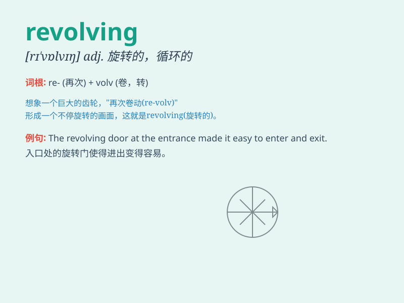

## revolving

**英音:** _[rɪ\'vɒlvɪŋ]_ **美音:** _[rɪ\'vɔlvɪŋ]_

**译义:** *v.旋转adj.旋转的*

### 短语

+ **revolving door:** _旋转门_

+ **revolving credit:** _循环信贷_

+ **revolving fund:** _循环基金_

+ **revolving stage:** _旋转舞台_

+ **revolving loan:** _循环贷款_

### 例句

#### 例句1

> **The revolving door kept spinning as people entered and exited the
building.**

**中文翻译:** 旋转门不停地转动，人们进进出出这座大楼。

**单词释义:** 旋转的

#### 例句2

> **The revolving stage presented a beautiful scene during the
performance.**

**中文翻译:** 在表演期间，旋转舞台呈现出美丽的场景。

**单词释义:** 旋转的

#### 例句3

> **The bank offers a revolving credit facility to its customers.**

**中文翻译:** 这家银行向其客户提供循环信贷额度。

**单词释义:** 循环的；可周转的

### 背诵小故事

> A little monkey was playing on a revolving chair in the park. It kept
spinning around and around, having so much fun. The chair\'s revolving
movement made the monkey laugh.

**一只小猴子在公园里玩一个旋转椅。它不停地转啊转，玩得非常开心。椅子的旋转运动让猴子大笑。**

### 图义

