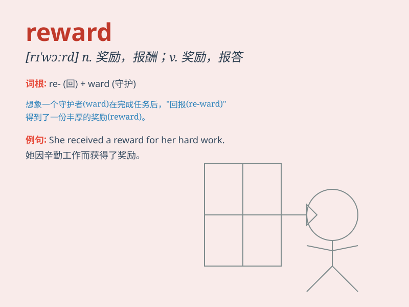

## reward

**英音:** _[rɪ\'wɔːd]_ **美音:** _[rɪ\'wɔrd]_

**译义:** *n.报酬,奖金vt.酬劳,奖赏*

### 短语

+ **reward system:** _奖励制度_

+ **financial reward:** _财务奖励_

+ **reward for:** _因\...\...而获得的奖励_

+ **monetary reward:** _金钱奖励_

+ **reward scheme:** _奖励方案_

### 例句

#### 例句1

> **She received a large reward for her hard work.**

**中文翻译:** 她因努力工作而获得了一大笔奖励。

**单词释义:** 奖励；报酬

#### 例句2

> **The company offers rewards to employees who come up with
innovative ideas.**

**中文翻译:** 公司向提出创新想法的员工提供奖励。

**单词释义:** 奖励；奖赏

#### 例句3

> **His good deeds were finally rewarded.**

**中文翻译:** 他的善举最终得到了回报。

**单词释义:** 回报；报答

### 背诵小故事

> A brave knight rescued the princess from the evil dragon. The king
was so pleased that he gave the knight a big bag of gold as a reward.
The knight was very happy and felt his efforts were worth it.

**一位勇敢的骑士从恶龙手中救出了公主。国王非常高兴，给了骑士一大袋金子作为奖赏。骑士非常开心，觉得自己的努力很值得。**

### 图义

