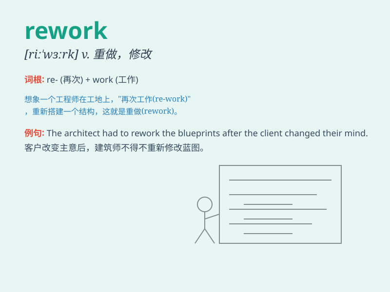

## rework

**英音:** _[riː\'wɜːk]_ **美音:** _[,ri\'wɝk]_

**译义:** *vt.重做,改写,重写*

### 短语

+ **rework plan:** _返工计划_

+ **rework cost:** _返工成本_

+ **rework process:** _返工流程_

+ **rework time:** _返工时间_

+ **rework order:** _返工订单_

### 例句

#### 例句1

> **The engineer had to rework the design to meet the new
requirements.**

**中文翻译:** 这位工程师不得不重新修改设计以满足新的要求。

**单词释义:** 重新修改；重做

#### 例句2

> **We need to rework the entire plan from scratch.**

**中文翻译:** 我们需要从头开始重新制定整个计划。

**单词释义:** 重新制定；重新处理

#### 例句3

> **The artist decided to rework the painting to add more
details.**

**中文翻译:** 这位艺术家决定重新创作这幅画以添加更多细节。

**单词释义:** 重新创作；重新加工

### 背诵小故事

> A factory worker was unhappy with the old machine. So, he decided to
rework it. He spent days taking it apart and putting it back together
better. Now the machine worked perfectly!

**一位工厂工人对旧机器不满意。所以，他决定对其进行改造。他花了好几天时间把它拆开然后重新组装得更好。现在这台机器运行得非常完美！**

### 图义

