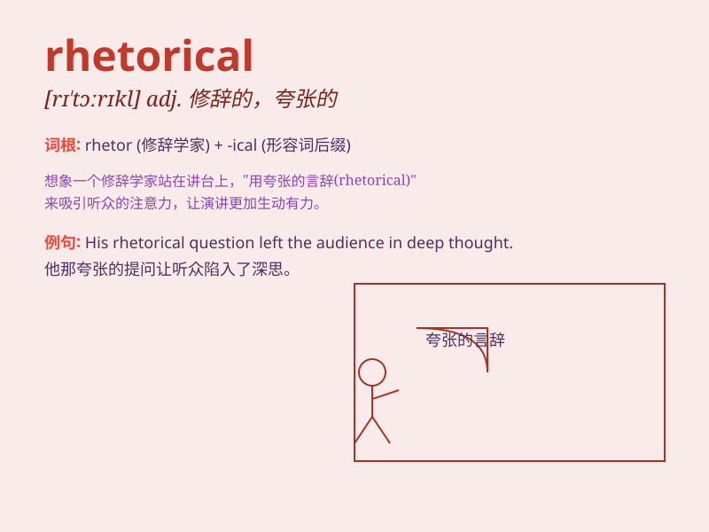

## rhetorical

**英音:** _[rɪ\'tɒrɪk(ə)l]_ **美音:** _[rɪ\'tɔrɪkl]_

**译义:** *adj.带修辞色彩的*

### 短语

+ **rhetorical question:** _反问句；修辞性疑问句_

+ **rhetorical device:** _修辞手段；修辞手法_

+ **rhetorical flourish:** _华丽的辞藻；修辞上的渲染_

+ **rhetorical effect:** _修辞效果_

+ **rhetorical skill:** _修辞技巧_

### 例句

#### 例句1

> **His speech was full of rhetorical devices to persuade the
audience.**

**中文翻译:** 他的演讲充满了说服听众的修辞手段。

**单词释义:** 修辞的；用于修辞的

#### 例句2

> **The question was merely rhetorical and didn\'t require a real
answer.**

**中文翻译:** 这个问题只是修辞性的，不需要真正的答案。

**单词释义:** 修辞性的

#### 例句3

> **She made a rhetorical appeal to the emotions of the crowd.**

**中文翻译:** 她用修辞手法调动了群众的情绪。

**单词释义:** 修辞的；夸张的

### 背诵小故事

> A student was always using rhetorical questions in class, like \'Why
do we have to study this?\' The teacher explained that rhetorical
questions are not meant to be answered but to make a point. So, the
student understood what rhetorical means.

**一个学生在课堂上总是使用修辞性的问题，比如'我们为什么要学这个？'老师解释说修辞性问题不是为了得到回答，而是为了表明观点。于是，学生明白了rhetorical的意思。**

### 图义

