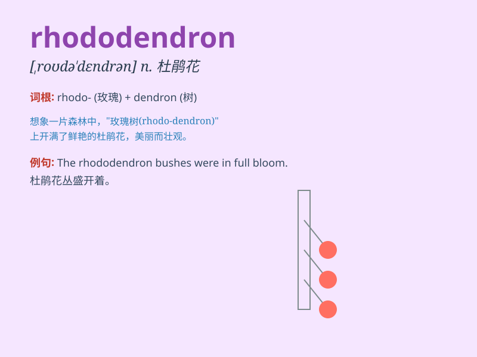

## rhododendron

**英音:** _[,rəʊdə\'dendr(ə)n]_ **美音:**
_[,rodə\'dɛndrən]_

**译义:** *n.[植]北美杜鹃,杜鹃花*

### 短语

+ **rhododendron bush:** _杜鹃花灌木丛_

+ **rhododendron garden:** _杜鹃花花园_

+ **rare rhododendron:** _珍稀的杜鹃花_

+ **wild rhododendron:** _野生杜鹃花_

+ **colorful rhododendron:** _色彩斑斓的杜鹃花_

### 例句

#### 例句1

> **The rhododendron in the garden is in full bloom, creating a
beautiful scene.**

**中文翻译:** 花园里杜鹃花盛开，景色美丽。

**单词释义:** 杜鹃花

#### 例句2

> **We went hiking in the mountains and saw many rhododendrons along
the way.**

**中文翻译:** 我们去山里徒步旅行，沿途看到了很多杜鹃花。

**单词释义:** 杜鹃花

#### 例句3

> **The rare rhododendron species is protected by law.**

**中文翻译:** 珍稀杜鹃花品种受法律保护。

**单词释义:** 杜鹃花

### 背诵小故事

>
想象一下，在一片神秘的森林里，有一只红色的（rhod）小鹿（do）在跳舞（den），旁边是杜鹃花丛（dron）。这些美丽的杜鹃花就是\'rhododendron\'，中文意思是\'杜鹃花\'。

**想象在森林中红色的小鹿在杜鹃花丛旁跳舞来记住\'rhododendron\'这个单词，意思是\'杜鹃花\'**

### 图义

