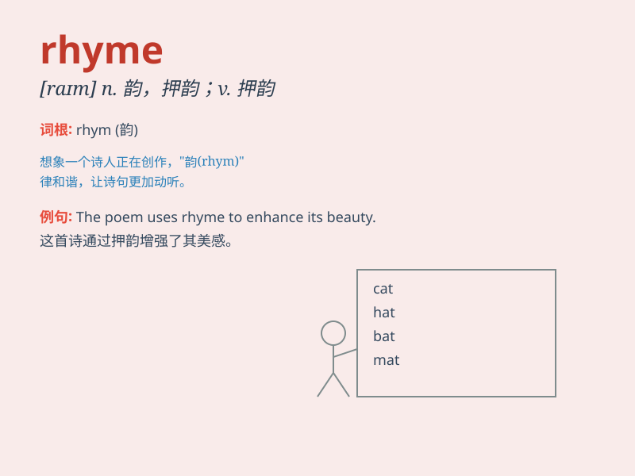

## rhyme

**英音:** _[raɪm]_ **美音:** _[raɪm]_

**译义:**
*n.韵,押韵,押韵的词vi.押韵,作诗,韵律和谐vt.使押韵,用韵诗表达,把\...写成诗*

### 短语

+ **rhyme scheme:** _韵律格式；押韵格式_

+ **nursery rhyme:** _童谣；儿歌_

+ **end rhyme:** _尾韵；行尾押韵_

+ **internal rhyme:** _中间韵；行内押韵_

+ **rhyme or reason:** _逻辑性；条理_

### 例句

#### 例句1

> **The words \'cat\' and \'hat\' rhyme.**

**中文翻译:** "猫"和"帽子"这两个词押韵。

**单词释义:** 押韵

#### 例句2

> **She wrote a poem that rhymes beautifully.**

**中文翻译:** 她写了一首押韵优美的诗。

**单词释义:** （使）押韵

#### 例句3

> **The children were asked to find words that rhyme with
\'tree\'.**

**中文翻译:** 孩子们被要求找到与"树"押韵的单词。

**单词释义:** 押韵

### 背诵小故事

> One day, a little poet was trying to write a poem. He struggled to
find words that rhyme. But finally, he found the perfect ones and his
poem became a beautiful rhyme. Now you know, \'rhyme\' means the
similarity in sound between words or the end of words.

**有一天，一位小诗人在努力写诗。他努力寻找押韵的词。但最终，他找到了完美的词，他的诗成了优美的韵文。现在你知道了，'rhyme'意思是词或词尾在发音上的相似性。**

### 图义

