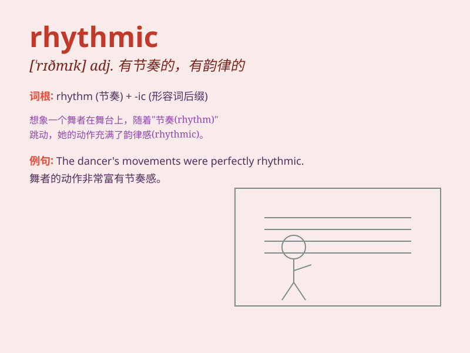

## rhythmic

**英音:** _[ˈrɪðmɪk]_ **美音:** _[ˈrɪðmɪk]_

**译义:** *adj.节奏的,合拍的*

### 短语

+ **rhythmic pattern:** _有节奏的模式_

+ **rhythmic movement:** _有节奏的运动_

+ **rhythmic music:** _有节奏的音乐_

+ **rhythmic dance:** _有节奏的舞蹈_

+ **rhythmic beat:** _有节奏的节拍_

### 例句

#### 例句1

> **The dancer moved in a rhythmic pattern.**

**中文翻译:** 舞者以有节奏的方式移动。

**单词释义:** 有节奏的

#### 例句2

> **The music has a strong rhythmic beat.**

**中文翻译:** 音乐有很强的节奏感。

**单词释义:** 有节奏的

#### 例句3

> **His breathing became rhythmic and calm.**

**中文翻译:** 他的呼吸变得有节奏而平静。

**单词释义:** 有节奏的

### 背诵小故事

> A dancer was struggling to master the rhythmic beats of a new dance.
One night, she dreamt of being in a magical forest where the trees
swayed in a rhythmic manner. When she woke up, she perfectly understood
the rhythm and danced beautifully.

**一位舞者努力掌握新舞蹈的有节奏的节拍。一天晚上，她梦到自己在一个神奇的森林里，那里的树木有节奏地摇曳。当她醒来时，她完全理解了节奏，跳得很美。**

### 图义

