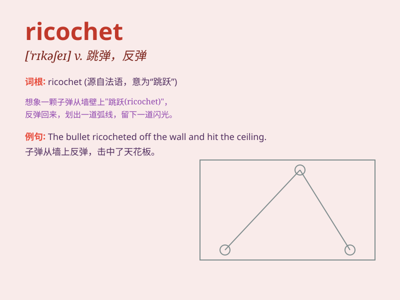

## ricochet

**英音:** _[\'rɪkəʃeɪ; -ʃet]_ **美音:** _[,rɪkə\'ʃet]_

**译义:** *n.跳飞,跳弹v.(使)跳飞*

### 短语

+ **ricochet off:** _从\...\...弹开_

+ **ricochet around:** _四处反弹_

+ **ricochet between:** _在\...\...之间反弹_

+ **ricochet into:** _弹入_

+ **ricochet out of:** _从\...\...弹出来_

### 例句

#### 例句1

> **The bullet ricocheted off the wall and nearly hit him.**

**中文翻译:** 子弹从墙上弹开，差点击中他。

**单词释义:** 反弹；弹开

#### 例句2

> **The stone ricocheted across the surface of the lake.**

**中文翻译:** 石头在湖面上弹跳起来。

**单词释义:** 弹跳；跳跃

#### 例句3

> **His words ricocheted around the room, causing a stir.**

**中文翻译:** 他的话在房间里回荡，引起了轩然大波。

**单词释义:** （声音等）回响；回荡

### 背诵小故事

> A brave soldier threw a grenade. It hit the wall and ricocheted away,
surprising the enemies. The ricochet of the grenade made everyone panic.
Remember, ricochet means to bounce or rebound.

**一位勇敢的士兵扔出了一颗手榴弹。它撞到墙上弹开了，让敌人感到惊讶。手榴弹的反弹让每个人都惊慌失措。记住，ricochet
意思是反弹、弹回。**

### 图义

