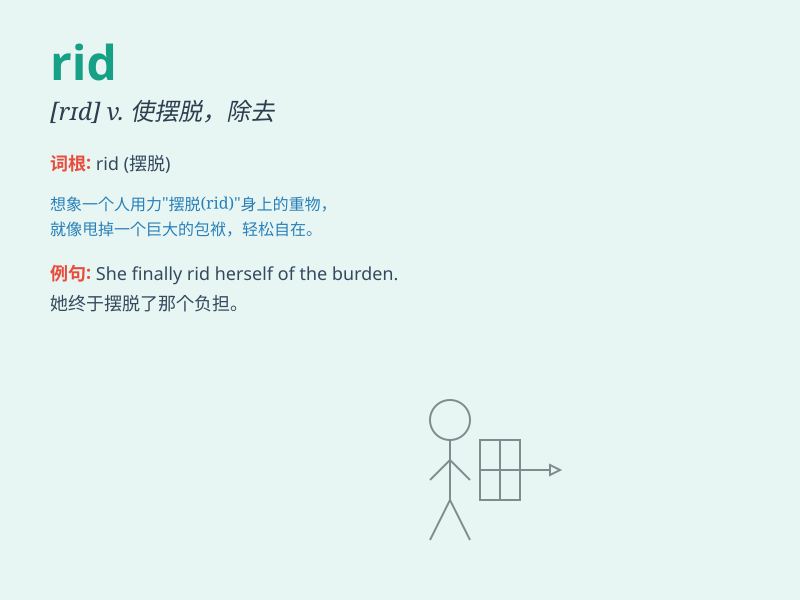

## rid

**英音:** _[rɪd]_ **美音:** _[rɪd]_

**译义:** *vt.使摆脱,使去掉*

### 短语

+ **get rid of:** _摆脱；除去；处理掉_

+ **rid oneself of:** _摆脱；戒除；除去_

+ **be rid of:** _摆脱；除掉；去掉_

+ **rid\...of\...:** _使\...摆脱\...；使\...去除\..._

+ **rid out:** _安然度过；经受住_

### 例句

#### 例句1

> **I want to rid myself of this bad habit.**

**中文翻译:** 我想改掉这个坏习惯。

**单词释义:** 摆脱；去除

#### 例句2

> **We must rid the house of rats.**

**中文翻译:** 我们必须消灭房子里的老鼠。

**单词释义:** 清除；消灭

#### 例句3

> **He managed to rid the team of dissension.**

**中文翻译:** 他设法消除了团队的分歧。

**单词释义:** 消除；摆脱

### 背诵小故事

> One day, a brave knight decided to rid the village of a fierce
dragon. He fought hard and finally got rid of the monster, making the
village safe again.

**一天，一位勇敢的骑士决定除掉村子里凶猛的龙。他奋力战斗，最终摆脱了这只怪兽，让村子再次安全。**

### 图义

