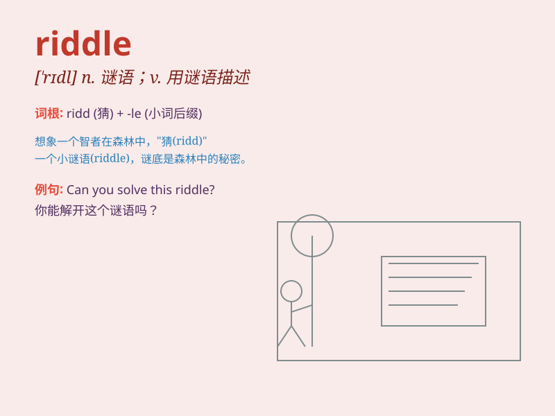

## riddle

**英音:** _[\'rɪd(ə)l]_ **美音:** _[\'rɪdl]_

**译义:** *n.谜,谜语,神秘人物v.解谜,出谜,迷惑*

### 短语

+ **solve a riddle:** _解答一个谜语_

+ **puzzle riddle:** _谜题谜语_

+ **riddle game:** _谜语游戏_

+ **mysterious riddle:** _神秘的谜语_

+ **complex riddle:** _复杂的谜语_

### 例句

#### 例句1

> **The riddle was too difficult for me to solve.**

**中文翻译:** 这个谜语对我来说太难解开了。

**单词释义:** 谜语；谜题

#### 例句2

> **She asked me a riddle about animals.**

**中文翻译:** 她问我一个关于动物的谜语。

**单词释义:** 谜语；谜题

#### 例句3

> **Life is often like a riddle, full of mysteries.**

**中文翻译:** 人生往往就像一个谜，充满了谜团。

**单词释义:** 谜；神秘的事物

### 背诵小故事

> One day, a little boy was trying to solve a riddle. The riddle was
like a maze. He thought hard and finally found the answer. It was so
exciting!

**有一天，一个小男孩正在努力解开一个谜语。这个谜语就像一个迷宫。他努力思考，最终找到了答案。太令人兴奋了！**

### 图义

