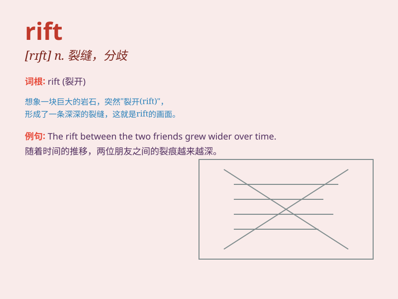

## rift

**英音:** _[rɪft]_ **美音:** _[rɪft]_

**译义:** *n.裂缝,裂口,断裂,长狭谷,不和*

### 短语

+ **major rift:** _重大裂痕_

+ **emotional rift:** _情感裂痕_

+ **widen the rift:** _扩大裂痕_

+ **heal the rift:** _修复裂痕_

+ **rift valley:** _裂谷_

### 例句

#### 例句1

> **A rift has developed between the two leaders.**

**中文翻译:** 两位领导人之间出现了裂痕。

**单词释义:** 裂痕；分歧

#### 例句2

> **The earthquake caused a rift in the ground.**

**中文翻译:** 地震导致地面出现裂痕。

**单词释义:** 裂缝

#### 例句3

> **The rift within the family was difficult to heal.**

**中文翻译:** 家庭内部的裂痕难以弥合。

**单词释义:** 裂痕；分歧

### 背诵小故事

> In a peaceful village, there was a sudden rift. A huge crack appeared
in the ground, separating the land. People were shocked and worried.
They tried hard to fix this rift and restore the village to its former
state.

**在一个宁静的村庄，突然出现了一道裂痕。地面上出现了一个巨大的裂缝，将土地分割开来。人们感到震惊和担忧。他们努力去修复这道裂痕，让村庄恢复原状。**

### 图义

