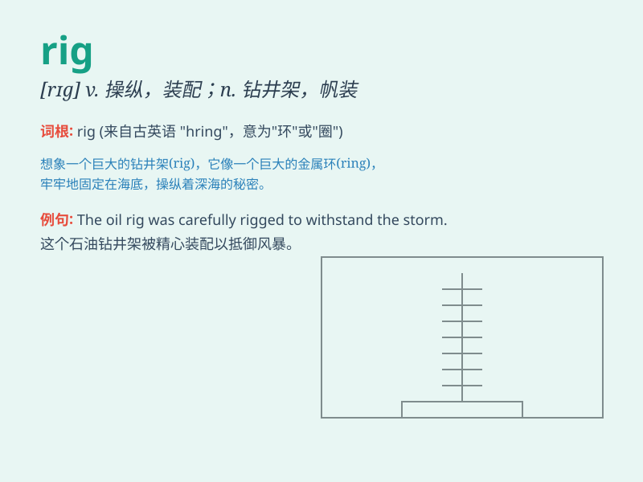

## rig

**英音:** _[rɪg]_ **美音:** _[rɪɡ]_

**译义:** *n.索具装备,钻探设备,钻探平台,钻塔v.装上索具,配备,装配*

### 短语

+ **rig out:** _盛装；装扮_

+ **rig up:** _临时搭建；草草做成_

+ **oil rig:** _石油钻塔；石油钻井平台_

+ **rig the market:** _操纵市场_

+ **rig the election:** _操纵选举_

### 例句

#### 例句1

> **They rigged the election to ensure their candidate won.**

**中文翻译:** 他们操纵选举以确保他们的候选人获胜。

**单词释义:** 操纵；控制

#### 例句2

> **The oil rig was damaged in the storm.**

**中文翻译:** 石油钻井平台在暴风雨中受损。

**单词释义:** 钻井平台；钻塔

#### 例句3

> **He rigged up a simple shelter for the night.**

**中文翻译:** 他搭建了一个简单的避难所过夜。

**单词释义:** 装配；搭建

### 背诵小故事

> A group of workers was trying to rig a huge machine. They spent a lot
of time adjusting and fixing it to make it work properly. Finally, they
succeeded and the machine was ready to operate.

**一群工人正在设法装配一台巨大的机器。他们花了很多时间调试和固定它，以使它能正常工作。最后，他们成功了，机器准备运行。**

### 图义

