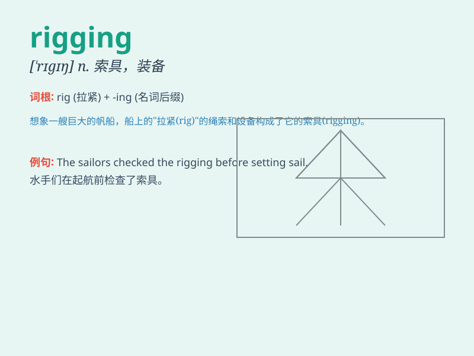

## rigging

**英音:** _[\'rɪgɪŋ]_ **美音:** _[\'rɪgɪŋ]_

**译义:** *n.索具,绳索,传动装置,装备*

### 短语

+ **ship rigging:** _船用索具_

+ **election rigging:** _选举舞弊_

+ **rigging equipment:** _索具设备_

+ **rigging system:** _索具系统_

+ **rigging work:** _索具工作_

### 例句

#### 例句1

> **The investigation revealed widespread rigging in the
election.**

**中文翻译:** 调查揭露了选举中普遍存在的舞弊行为。

**单词释义:** 操纵；舞弊

#### 例句2

> **The sailors were busy with the rigging of the ship.**

**中文翻译:** 水手们正忙着装船。

**单词释义:** 索具；绳索装置

#### 例句3

> **The rigging of the market led to an unfair competition.**

**中文翻译:** 市场操纵导致不公平竞争。

**单词释义:** 操纵；控制

### 背诵小故事

>
想象一下在一艘大船上，船员们正在忙碌地操作绳索和设备，这些绳索和设备的组合就是\'rigging\'。它们控制着船帆，决定着船的方向和速度。所以\'rigging\'就是指船上的索具、绳索装置。

**想象在大船上船员操作的绳索和设备组合就是"rigging"，指船上的索具、绳索装置**

### 图义

