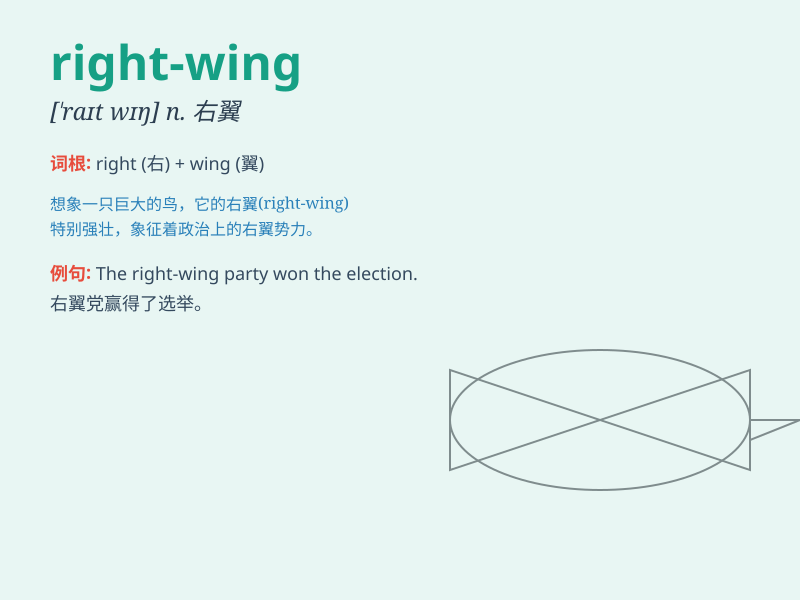

## right-wing

**英音:** _[ˈraɪt-wɪŋ]_ **美音:** _[ˈraɪt-wɪŋ]_

**译义:** *形容词，右翼的；指在政治上持保守或极端保守立场的*

### 短语

+ **right-wing party:** _右翼政党_

+ **right-wing ideology:** _右翼意识形态_

+ **right-wing politician:** _右翼政治家_

+ **right-wing group:** _右翼团体_

+ **right-wing view:** _右翼观点_

### 例句

#### 例句1

> **The politician is known for his right-wing views on
immigration.**

**中文翻译:** 这位政治家因其在移民问题上的右翼观点而闻名。

**单词释义:** 右翼的

#### 例句2

> **The right-wing party gained significant support in the recent
election.**

**中文翻译:** 右翼政党在最近的选举中获得了大量支持。

**单词释义:** 右翼的

#### 例句3

> **She is often criticized for her right-wing economic policies.**

**中文翻译:** 她因其右翼的经济政策经常受到批评。

**单词释义:** 右翼的

### 背诵小故事

> 想象一只老鹰总是向右飞，它代表着一种保守的力量，被称为
right-wing。就像政治中的右翼，倾向于传统和保守的观点。

**想象一只总是向右飞的老鹰代表右翼，就像政治中倾向传统和保守观点的右翼。**

### 图义

