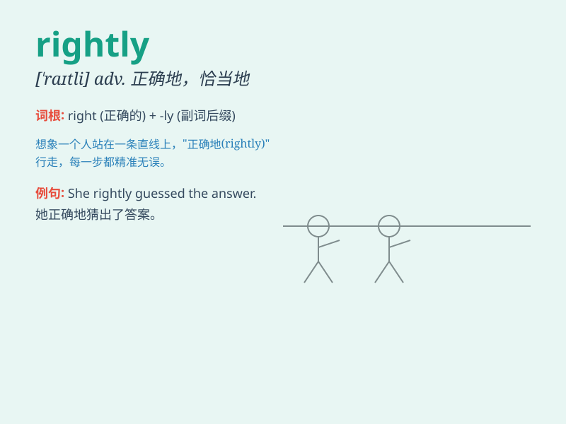

## rightly

**英音:** _[\'raɪtlɪ]_ **美音:** _[\'raɪtli]_

**译义:** *adv.端正地,正当地,正确地,公正地,恰当地*

### 短语

+ **rightly so:** _理应如此_

+ **rightly or wrongly:** _不管对错_

+ **rightly guided:** _正确引导的_

+ **rightly deserved:** _当之无愧_

+ **rightly assume:** _合理地假设_

### 例句

#### 例句1

> **He was rightly proud of his achievements.**

**中文翻译:** 他对自己的成就感到自豪。

**单词释义:** 理所当然地

#### 例句2

> **She rightly guessed that he was lying.**

**中文翻译:** 她猜对了，他在撒谎。

**单词释义:** 正确地

#### 例句3

> **The decision was rightly seen as a mistake.**

**中文翻译:** 这个决定被正确地视为一个错误。

**单词释义:** 理所当然地

### 背诵小故事

> One day, a little boy was lost. But he rightly remembered his home
address and found his way back. His parents were proud of him for doing
the right thing.

**一天，一个小男孩迷路了。但他正确地记住了他家的地址并找到了回去的路。他的父母为他做了正确的事而感到骄傲。**

### 图义

