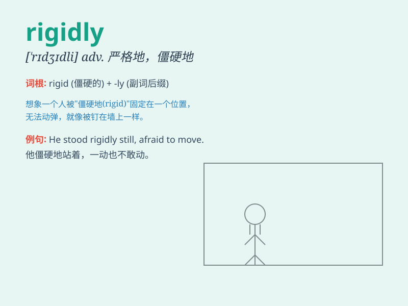

## rigidly

**英音:** _[\'rɪdʒɪdli]_ **美音:** _[\'rɪdʒɪdli]_

**译义:** *adv.坚硬地,严格地*

### 短语

+ **rigidly controlled:** _严格控制_

+ **rigidly structured:** _结构僵化_

+ **rigidly adhere to:** _严格遵守_

+ **rigidly enforce:** _严格执行_

+ **rigidly defined:** _严格定义_

### 例句

#### 例句1

> **He adheres rigidly to the rules.**

**中文翻译:** 他严格遵守规则。

**单词释义:** 严格地

#### 例句2

> **The machine is designed rigidly for a specific purpose.**

**中文翻译:** 该机器是为特定目的而严格设计的。

**单词释义:** 严格地

#### 例句3

> **She held her head rigidly upright.**

**中文翻译:** 她的头僵硬地挺直。

**单词释义:** 僵硬地

### 背诵小故事

> A robot was moving rigidly in a factory. It could only follow strict
orders and couldn\'t change its movements flexibly. This showed how
\'rigidly\' means stiffly and without flexibility.

**一个机器人在工厂里僵硬地移动。它只能遵循严格的指令，不能灵活地改变它的动作。这展示了\'rigidly\'意味着僵硬地、不灵活地。**

### 图义

