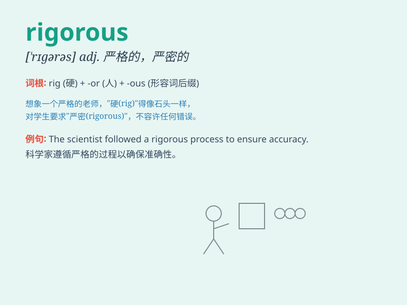

## rigorous

**英音:** _[\'rɪg(ə)rəs]_ **美音:** _[\'rɪɡərəs]_

**译义:** *adj.严格的,严厉的,严酷的,严峻的*

### 短语

+ **rigorous analysis:** _严谨的分析_

+ **rigorous training:** _严格的训练_

+ **rigorous examination:** _严格的检查_

+ **rigorous research:** _严谨的研究_

+ **rigorous discipline:** _严格的纪律_

### 例句

#### 例句1

> **The scientist conducted a rigorous experiment to test the
hypothesis.**

**中文翻译:** 科学家进行了严格的实验来检验这个假设。

**单词释义:** 严谨的

#### 例句2

> **The company has a rigorous quality control system to ensure
product safety.**

**中文翻译:** 公司拥有严格的质量控制体系，确保产品安全。

**单词释义:** 严格的

#### 例句3

> **She went through a rigorous training program before becoming a
pilot.**

**中文翻译:** 在成为飞行员之前，她接受了严格的培训计划。

**单词释义:** 严格的

### 背诵小故事

> A scientist was conducting a rigorous experiment. Every step was
carefully planned and executed. No mistakes were allowed. This shows the
meaning of \'rigorous\' - strict, precise and thorough.

**一位科学家正在进行一项严谨的实验。每一步都经过精心规划和执行。不允许有任何错误。这体现了'rigorous'严格、精确和彻底的意思。**

### 图义

