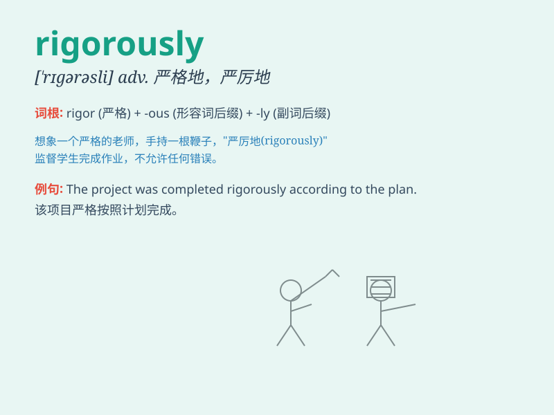

## rigorously

**英音:** _[ˈrɪgərəsli]_ **美音:** _[ˈrɪgərəsli]_

**译义:** *adv.严厉地,残酷地*

### 短语

+ **rigorously enforce:** _严格执行_

+ **rigorously test:** _严格测试_

+ **rigorously examine:** _严格审查_

+ **rigorously train:** _严格训练_

+ **rigorously control:** _严格控制_

### 例句

#### 例句1

> **The research was conducted rigorously to ensure accurate
results.**

**中文翻译:** 该研究进行严格，以确保结果准确。

**单词释义:** 严格地

#### 例句2

> **She trained rigorously for the competition.**

**中文翻译:** 为了比赛，她进行了严格的训练。

**单词释义:** 严格地

#### 例句3

> **The safety measures are enforced rigorously in this factory.**

**中文翻译:** 该工厂严格执行安全措施。

**单词释义:** 严格地

### 背诵小故事

> A scientist was conducting experiments rigorously. He checked every
detail, made no mistakes, and followed strict procedures. His rigorous
attitude led to a major discovery. Remember, \'rigorously\' means very
strictly and carefully.

**一位科学家正在严格地进行实验。他检查每一个细节，不犯任何错误，并遵循严格的程序。他严谨的态度导致了一项重大发现。记住，\'rigorously\'意思是非常严格且仔细地。**

### 图义

