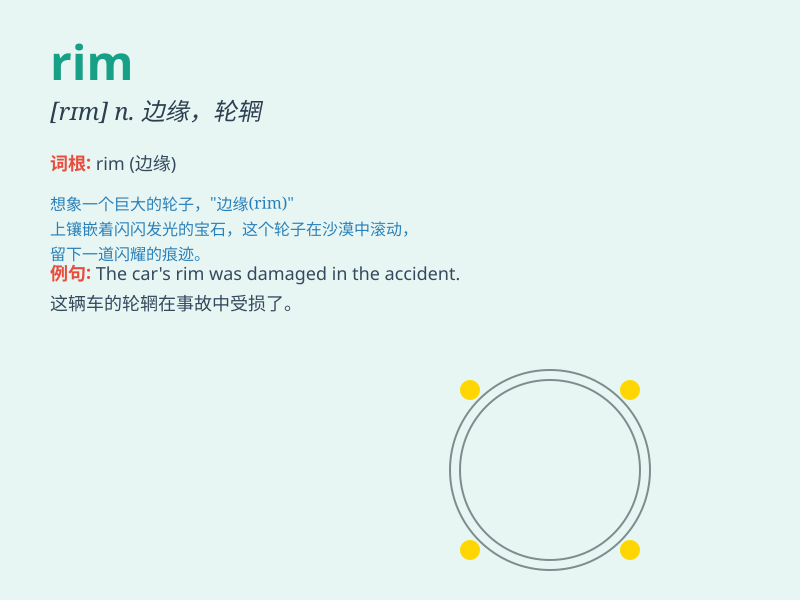

## rim

**英音:** _[rɪm]_ **美音:** _[rɪm]_

**译义:**
*n.边,轮缘,蓝框vt.镶边,为\...装边,沿\...边缘滚动vi.形成边状*

### 短语

+ **rim of a cup:** _杯子的边缘_

+ **rim of a hat:** _帽子的边缘_

+ **wheel rim:** _车轮的轮辋_

+ **rim of the eye:** _眼眶_

+ **rim of the glass:** _玻璃杯的边缘_

### 例句

#### 例句1

> **The rim of the cup was chipped.**

**中文翻译:** 杯子的边缘有缺口。

**单词释义:** 边缘

#### 例句2

> **The wheels have shiny rims.**

**中文翻译:** 车轮有闪亮的轮辋。

**单词释义:** 轮辋

#### 例句3

> **She wiped the rim of the sink clean.**

**中文翻译:** 她把水槽的边缘擦干净。

**单词释义:** 边缘

### 背诵小故事

> Imagine a magical bicycle race. The winner gets a shiny trophy with a
special rim. It\'s not just any rim; it\'s beautifully decorated and
catches everyone\'s eye. That\'s how you\'ll remember \'rim\' - the edge
of something, like the edge of that trophy!

**想象一场神奇的自行车比赛。获胜者得到一个带有特殊轮辋的闪亮奖杯。这可不是普通的轮辋；它装饰精美，吸引了所有人的目光。这就是你记住\'rim\'的方法------某物的边缘，就像那个奖杯的边缘！**

### 图义

