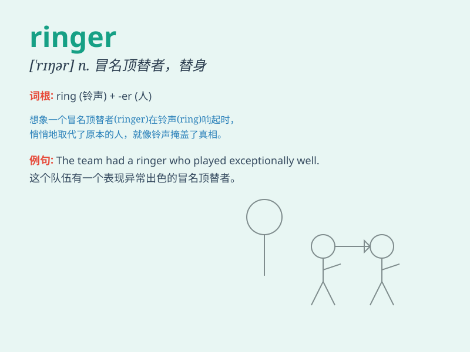

## ringer

**英音:** _[\'rɪŋə]_ **美音:** _[\'rɪŋɚ]_

**译义:** *n.套环,投环*

### 短语

+ **dead ringer:** _酷似某人；与某人一模一样的人_

+ **ring the changes:** _变换花样；以不同方式做（或说）_

+ **ring off:** _挂断电话_

+ **ring up:** _给...打电话；把（钱款）记入收款机_

+ **ring out:** _响起；发出响亮的声音_

### 例句

#### 例句1

> **The horse was a ringer for the champion.**

**中文翻译:** 这匹马是冠军的象征。

**单词释义:** 酷似的人或物

#### 例句2

> **He\'s a ringer for his older brother.**

**中文翻译:** 他是他哥哥的铃声。

**单词释义:** 酷似的人

#### 例句3

> **The racehorse was a ringer entered illegally.**

**中文翻译:** 这匹赛马是非法进入的。

**单词释义:** 冒名顶替者

### 背诵小故事

> There was a horse race. A man wanted to cheat, so he found a ringer,
a horse that looked exactly like the champion. But in the end, he was
caught. A ringer is a person or thing that is a fraudulently substituted
for another of similar appearance.

**有一场赛马。一个人想作弊，于是他找了个冒名顶替者，一匹看起来和冠军马一模一样的马。但最后，他被抓住了。ringer
指冒名顶替的人或物。**

### 图义

