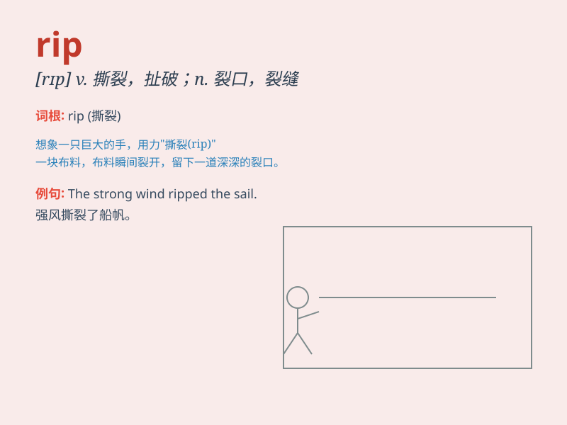

## rip

**英音:** _[rɪp]_ **美音:** _[rɪp]_

**译义:** *v.撕,剥,劈,锯,裂开,撕裂n.裂口,裂缝 愿灵安眠 RIP(rest in
peace)*

### 短语

+ **rip off:** _敲诈；欺骗_

+ **rip into:** _猛烈攻击；斥责_

+ **rip apart:** _撕开；扯破；使分裂_

+ **rip through:** _迅速穿过；穿透_

+ **let it rip:** _顺其自然；任其发展_

### 例句

#### 例句1

> **The strong wind ripped the flag from the pole.**

**中文翻译:** 强风把旗子从旗杆上扯了下来。

**单词释义:** 扯；撕；猛地扯开

#### 例句2

> **The flood ripped through the village, destroying many houses.**

**中文翻译:** 洪水席卷了村庄，摧毁了许多房屋。

**单词释义:** 冲开；冲破

#### 例句3

> **She ripped open the envelope impatiently.**

**中文翻译:** 她不耐烦地撕开了信封。

**单词释义:** 撕开；扯开

### 背诵小故事

> One day, I saw a poor shirt that had been torn apart. I said, \'This
shirt is ripped.\' It means torn or damaged. Just like that, I\'ll never
forget the word \'rip\'.

**有一天，我看到一件可怜的衬衫被扯破了。我说：'这件衬衫被撕破了。'rip
这个单词意思是撕破、扯坏。就像这样，我永远不会忘记'rip'这个单词。**

### 图义

