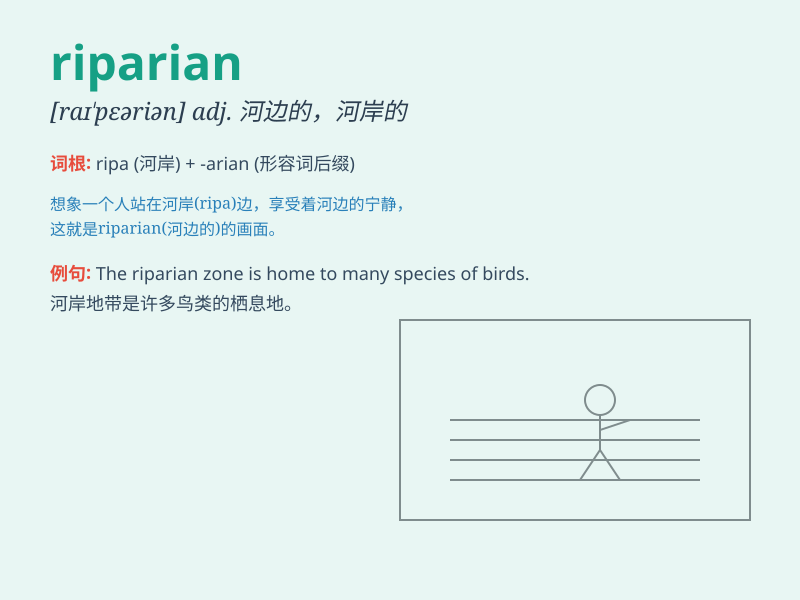

## riparian

**英音:** _[raɪ\'peərɪən]_ **美音:** _[raɪ\'pɛrɪən]_

**译义:** *adj.河边的,水滨的n.河岸拥有人*

### 短语

+ **riparian zone:** _河岸带；河岸地区_

+ **riparian habitat:** _河岸栖息地_

+ **riparian vegetation:** _河岸植被_

+ **riparian rights:** _河岸权_

+ **riparian ecosystem:** _河岸生态系统_

### 例句

#### 例句1

> **The riparian zone is home to a diverse range of wildlife.**

**中文翻译:** 河岸带是多种野生动物的家园。

**单词释义:** 河岸的；河边的

#### 例句2

> **Riparian rights are important for landowners along the river.**

**中文翻译:** 河岸权对于沿河土地所有者来说非常重要。

**单词释义:** 河岸的；河边的

#### 例句3

> **The riparian forest provides shade and stabilizes the
riverbank.**

**中文翻译:** 河岸森林提供阴凉并稳定河岸。

**单词释义:** 河岸的；河边的

### 背诵小故事

> A man was lost in the forest near a river. When he finally found a
way out, he realized he was in a riparian area. There were beautiful
plants and animals along the riverbank. Remember, riparian means related
to the bank of a river.

**一个男人在河边的森林里迷路了。当他最终找到出路时，他意识到自己身处河岸地区。河边有美丽的植物和动物。记住，riparian
意思是与河岸有关的。**

### 图义

