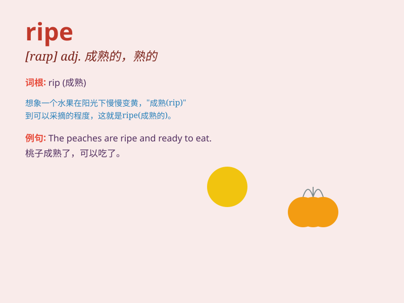

## ripe

**英音:** _[raɪp]_ **美音:** _[raɪp]_

**译义:** *adj.熟的,成熟的,时机成熟的v.成熟*

### 短语

+ **ripe fruit:** _成熟的水果_

+ **ripe age:** _成熟年龄；适宜的年龄_

+ **ripe for:** _适合；准备好_

+ **ripe cheese:** _成熟的奶酪_

+ **ripe opportunity:** _成熟的机会；绝佳的机会_

### 例句

#### 例句1

> **The peaches are ripe and ready to eat.**

**中文翻译:** 桃子已经熟了，可以吃了。

**单词释义:** 成熟的

#### 例句2

> **The time is ripe for change.**

**中文翻译:** 变革的时机已经成熟。

**单词释义:** 成熟的；适宜的

#### 例句3

> **The cheese has ripened nicely.**

**中文翻译:** 奶酪已经成熟得很好。

**单词释义:** 成熟；熟透

### 背诵小故事

> One day, I went to the orchard and saw many fruits. The apples were
red and big. They were ripe and ready to be picked. I tasted one, and it
was so sweet.

**一天，我去果园，看到很多水果。苹果又红又大。它们成熟了，可以采摘了。我尝了一个，非常甜。**

### 图义

