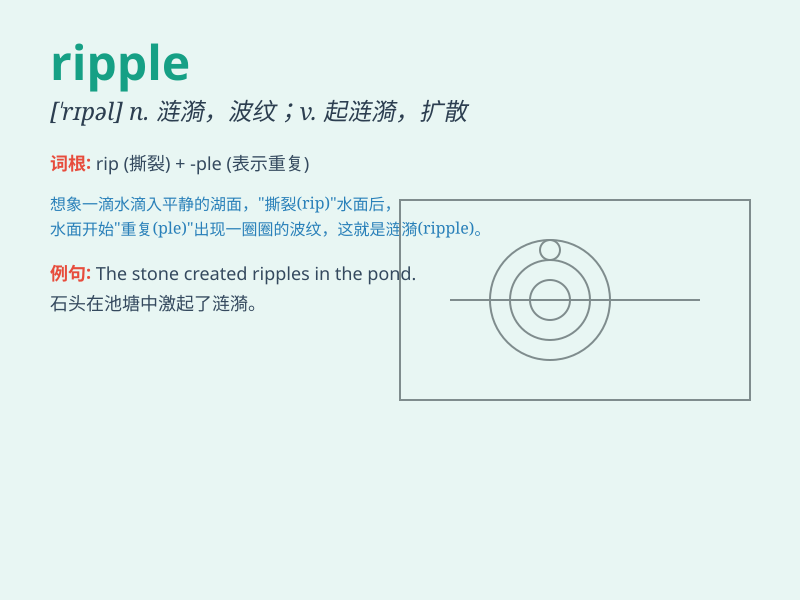

## ripple

**英音:** _[\'rɪp(ə)l]_ **美音:** _[\'rɪpl]_

**译义:** *n.波纹v.起波纹*

### 短语

+ **ripple effect:** _连锁反应；涟漪效应_

+ **surface ripple:** _表面波纹_

+ **ripple current:** _纹波电流；脉动电流_

+ **voltage ripple:** _电压纹波；电压脉动_

+ **ripple through:** _波及；传遍_

### 例句

#### 例句1

> **The breeze caused ripples on the surface of the lake.**

**中文翻译:** 微风吹过，湖面上泛起阵阵涟漪。

**单词释义:** 涟漪；细浪

#### 例句2

> **The news of his resignation rippled through the company.**

**中文翻译:** 他辞职的消息传遍了公司。

**单词释义:** （消息等）传开；扩散

#### 例句3

> **A ripple of laughter went through the crowd.**

**中文翻译:** 人群中爆发出一阵笑声。

**单词释义:** （声音等的）波动；荡漾

### 背诵小故事

> A little duck swam in the lake. Its movement caused ripples on the
water surface. The ripples spread out in circles, making the lake look
so lively.

**一只小鸭子在湖里游。它的游动在水面引起了涟漪。涟漪一圈圈地扩散开来，让湖面看起来十分生动。**

### 图义

