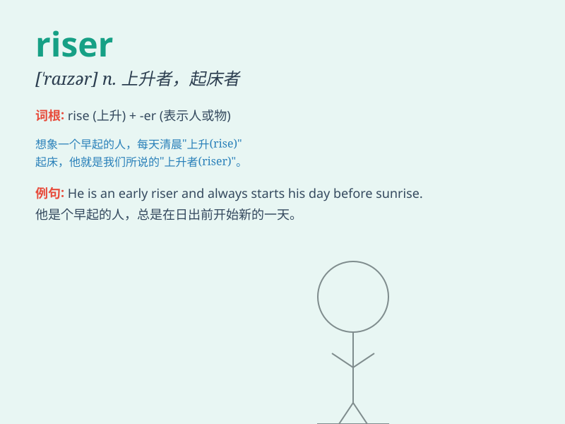

## riser

**英音:** _[\'raɪzə]_ **美音:** _[\'raɪzɚ]_

**译义:** *n.起床者,起义者,叛乱者*

### 短语

+ **stair riser:** _楼梯竖板_

+ **riser pipe:** _立管；竖管_

+ **cardiac riser:** _心搏上升_

+ **platform riser:** _平台立板_

+ **riser block:** _上升块_

### 例句

#### 例句1

> **The riser on the staircase was damaged.**

**中文翻译:** 楼梯上的立管已损坏。

**单词释义:** 竖板；上升物

#### 例句2

> **The early riser catches the worm.**

**中文翻译:** 早起者有虫吃。

**单词释义:** 早起的人

#### 例句3

> **The gas riser needs to be inspected regularly.**

**中文翻译:** 气体立管需要定期检查。

**单词释义:** 立管

### 背诵小故事

> There was a little boy named Tom. One day, he was climbing a
mountain. He was a riser, determined to reach the top. Despite the
difficulties, he kept going. Finally, he succeeded and saw the beautiful
view.

**有个小男孩叫汤姆。有一天，他在爬山。他是个奋进者，决心要到达山顶。尽管困难重重，他一直前进。最后，他成功了，看到了美丽的景色。**

### 图义

