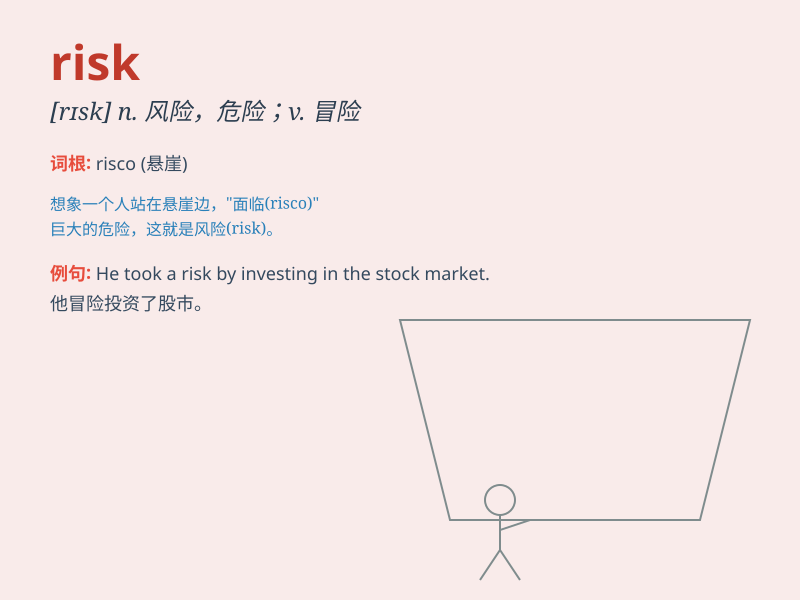

## risk

**英音:** _[rɪsk]_ **美音:** _[rɪsk]_

**译义:** *vt.冒\...的危险n.冒险,风险*

### 短语

+ **at risk:** _处于危险中_

+ **risk doing sth:** _冒险做某事_

+ **run the risk of:** _冒\...\...的危险_

+ **take a risk:** _冒险_

+ **at the risk of:** _冒着\...\...的危险_

### 例句

#### 例句1

> **He took a big risk when he invested all his money in that
business.**

**中文翻译:** 当他把所有的钱都投入到那项生意时，他冒了很大的风险。

**单词释义:** 风险；危险

#### 例句2

> **Don\'t risk your life for such a small matter.**

**中文翻译:** 不要为了这么一点小事而拿自己的生命冒险。

**单词释义:** 冒...的危险

#### 例句3

> **There is a risk of rain tomorrow.**

**中文翻译:** 明天有下雨的危险。

**单词释义:** 可能性；风险

### 背诵小故事

> One day, a brave adventurer decided to climb a tall mountain. His
friends warned him of the risks, like slippery paths and bad weather.
But he was determined. Finally, he reached the top safely, showing that
risks can lead to great rewards if faced bravely.

**一天，一位勇敢的冒险家决定攀登一座高山。他的朋友警告他存在风险，比如湿滑的道路和恶劣的天气。但他决心已定。最后，他安全到达山顶，表明如果勇敢面对，风险可能会带来巨大的回报。**

### 图义

