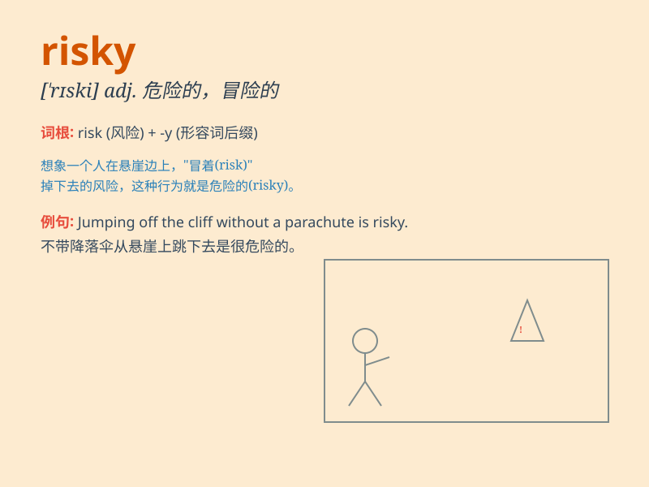

## risky

**英音:** _[\'rɪskɪ]_ **美音:** _[\'rɪski]_

**译义:** *adj.危险的*

### 短语

+ **risky business:** _危险的生意；冒险的事业_

+ **risky investment:** _高风险投资_

+ **risky behavior:** _冒险行为_

+ **risky proposition:** _冒险的提议_

+ **risky venture:** _冒险的创业；风险投机_

### 例句

#### 例句1

> **Investing in that start-up company is a risky venture.**

**中文翻译:** 投资这家初创公司是一项冒险行为。

**单词释义:** 有风险的

#### 例句2

> **Driving too fast on icy roads is very risky.**

**中文翻译:** 在结冰的道路上驾驶太快是非常危险的。

**单词释义:** 危险的

#### 例句3

> **It\'s risky to make a promise you might not be able to keep.**

**中文翻译:** 做出可能无法兑现的承诺是有风险的。

**单词释义:** 有风险的

### 背诵小故事

> One day, Tom decided to climb a very tall and unstable tree. His
friends warned him it was risky. But Tom didn\'t listen. Eventually, he
slipped and got hurt. This shows that doing dangerous things without
thinking is risky.

**有一天，汤姆决定爬上一棵很高且不稳的树。他的朋友们警告他这很冒险。但汤姆不听。最终，他滑倒受伤了。这表明不加思考地做危险的事是有风险的。**

### 图义

