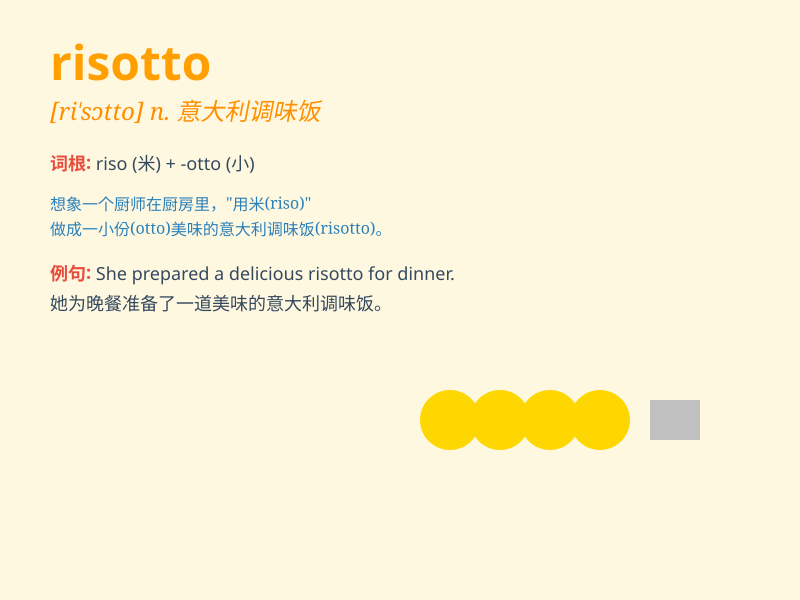

## risotto

**英音:** _[rɪ\'zɒtəʊ]_ **美音:** _[rɪ\'sɔto]_

**译义:** *n.意大利调味饭(肉汤加干酪等制成)*

### 短语

+ **mushroom risotto:** _蘑菇烩饭_

+ **seafood risotto:** _海鲜烩饭_

+ **cheese risotto:** _芝士烩饭_

+ **tomato risotto:** _番茄烩饭_

+ **spinach risotto:** _菠菜烩饭_

### 例句

#### 例句1

> **I had a delicious seafood risotto at the Italian restaurant last
night.**

**中文翻译:** 昨晚我在意大利餐厅吃了一顿美味的海鲜烩饭。

**单词释义:** 烩饭

#### 例句2

> **The chef is famous for his special mushroom risotto.**

**中文翻译:** 厨师以其特色蘑菇烩饭而闻名。

**单词释义:** 烩饭

#### 例句3

> **She learned to make risotto from her grandmother.**

**中文翻译:** 她从祖母那里学会了做意大利调味饭。

**单词释义:** 烩饭

### 背诵小故事

> A chef was making risotto. He carefully chose the best rice and added
rich ingredients. The smell of the risotto filled the kitchen. People
couldn\'t wait to taste this delicious dish.

**一位厨师正在做意大利调味饭。他精心挑选了最好的大米，并添加了丰富的食材。意大利调味饭的香味充满了厨房。人们迫不及待地想品尝这道美味佳肴。**

### 图义

