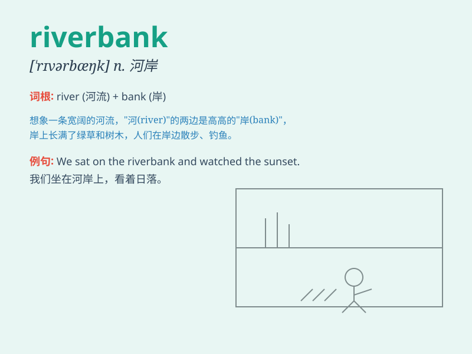

## riverbank

**英音:** _[\'rɪvəbæŋk]_ **美音:** _[\'rɪvɚbæŋk]_

**译义:** *n.河堤,河岸*

### 短语

+ **along the riverbank:** _沿着河岸_

+ **on the riverbank:** _在河岸上_

+ **riverbank erosion:** _河岸侵蚀_

+ **riverbank vegetation:** _河岸植被_

+ **steep riverbank:** _陡峭的河岸_

### 例句

#### 例句1

> **We sat on the riverbank and enjoyed the beautiful scenery.**

**中文翻译:** 我们坐在河岸上欣赏美丽的风景。

**单词释义:** 河岸

#### 例句2

> **The children were playing on the riverbank when it suddenly
started to rain.**

**中文翻译:** 孩子们正在河边玩耍，突然下起了雨。

**单词释义:** 河岸

#### 例句3

> **The fisherman set up his equipment on the riverbank and began to
fish.**

**中文翻译:** 渔夫在河岸上架起了渔具，开始钓鱼。

**单词释义:** 河岸

### 背诵小故事

> One day, a little boy was playing by the river. He saw a beautiful
butterfly near the riverbank. He wanted to catch it but was careful not
to fall into the river. The riverbank was his safe boundary.

**有一天，一个小男孩在河边玩耍。他在河岸附近看到一只漂亮的蝴蝶。他想抓住它，但小心不落入河中。河岸是他的安全边界。**

### 图义

